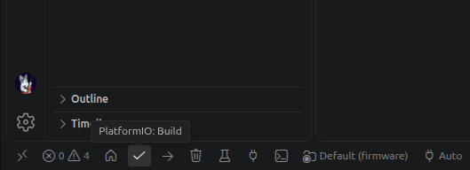

# Guia de Configuração 

## 1. Arquitetura resumida

### 1.1 Firmware embarcado

O firmware utiliza uma **Arquitetura em Camadas (Layered Architecture)** orientada a eventos/tarefas.

A divisão principal é:

```text
HAL / Drivers
      ↓
Controle e Navegação
      ↓
Comunicação e Armazenamento
```

### 1.2 Central de controle

O backend/frontend segue o padrão **MVC (Model-View-Controller)**:

```text
React frontend
      ↓
HTTP / WebSocket
      ↓
Backend Node.js
      ↓
Controllers
      ↓
Services
      ↓
Prisma
      ↓
PostgreSQL
```

### 1.3 Comunicação

A comunicação recomendada entre as partes é:

```text
ESP32 ── WebSocket ──> Backend
                         │
                         └── WebSocket ──> frontend
```

O ESP32 funciona como cliente de comunicação e o backend como servidor WebSocket da central.

---

## 2. Estrutura do repositório

A estrutura recomendada é:

```text
micromouse/
├── src/
|   ├── backend/
|   │   ├── prisma/
|   │   ├── src/
|   │   │   ├── controllers/
|   │   │   ├── services/
|   │   │   ├── routes/
|   │   │   ├── models/
|   │   │   ├── ws/
|   │   │   ├── lib/
|   │   │   ├── app.ts
|   │   │   └── server.ts
|   │   ├── .env
|   │   ├── prisma7.config.ts
|   │   ├── package.json
|   │   └── tsconfig.json
|   |
|   ├── firmware/
|   │   ├── include/
|   │   ├── lib/
|   │   ├── src/
|   │   │   ├── hal/
|   │   │   ├── control/
|   │   │   ├── navigation/
|   │   │   ├── communication/
|   │   │   ├── storage/
|   │   │   ├── tasks/
|   │   │   └── main.cpp
|   │   └── platformio.ini
|   |
|   └── frontend/
|       ├── src/
|       │   ├── components/
|       │   ├── pages/
|       │   ├── services/
|       │   ├── hooks/
|       │   ├── App.tsx
|       │   └── main.tsx
|       ├── package.json
|       └── vite.config.ts
├── docker-compose.yml
├── .gitignore
├── README.md
└── CONTRIBUTING.md

```

### Responsabilidade dos diretórios

| Diretório | Responsabilidade |
|---|---|
| `src/backend` | API, WebSocket, regras de negócio e persistência |
| `src/backend/prisma` | Schema e migrations do banco |
| `src/frontend` | Interface web de monitoramento |
| `firmware/src/hal` | Drivers de hardware |
| `firmware/src/control` | Controle PID, odometria e lógica de controle |
| `firmware/src/navigation` | Mapeamento e navegação/Floodfill |
| `firmware/src/communication` | Wi-Fi, WebSocket e comunicação de alto nível |
| `firmware/src/storage` | Persistência local no ESP32 |
| `firmware/src/tasks` | Tasks do FreeRTOS |
| `docker-compose.yml` | Infraestrutura local do PostgreSQL |

---

## 3. Pré-requisitos

Antes de começar, instale:

| Ferramenta | Versão de referência |
|---|---:|
| Node.js | `24.21.0` |
| npm | `11.19.0` |
| PlatformIO Core | `6.2.x` |
| Arduino ESP32 Core | `3.3.11` |
| PostgreSQL | `18.6` |
| Docker Engine | `29.8.x` |
| Docker Compose | `5.6.x` |
| Prisma CLI | `7.10.0` |

Também é necessário ter acesso ao hardware e aos cabos/programadores utilizados para o ESP32 quando a contribuição envolver firmware.

### Verificação do ambiente

```bash
node -v
npm -v
docker --version
docker compose version
pio --version
```

O resultado deve indicar versões compatíveis com as versões de referência acima.

---

## 4. Clonar o projeto

Clone o repositório e entre na pasta:

```bash
git clone https://github.com/fcte-pi1/2026.2_PI1_Grupo2_Lui.git # ou "git clone git@github.com:fcte-pi1/2026.2_PI1_Grupo2_Lui.git"
cd 2026.2_PI1_Grupo2_Lui/
```

---

## 5. Configuração do PostgreSQL

O PostgreSQL deve ser executado localmente por Docker Compose.

Na raiz do projeto:

```bash
docker compose up -d
```

Verifique os containers:

```bash
docker compose ps
```

O serviço esperado é:

```text
micromouse-postgres
```

### Parar o banco

```bash
docker compose down
```

## 6. Configuração do backend

Entre no backend:

```bash
cd src/backend
```

Instale as dependências:

```bash
npm install
```

O backend utiliza:

- TypeScript;
- Node.js;
- Express;
- `ws` para WebSocket;
- Prisma;
- PostgreSQL.

### Arquivo `.env`

Crie:

```text
apps/backend/.env
```

Exemplo:

```env
DATABASE_URL="postgresql://micromouse:<SENHA>@localhost:5432/micromouse?schema=public"
PORT=3000
```

> Nunca envie o `.env` para o Git.

### Banco e Prisma

Depois de iniciar o PostgreSQL:

```bash
npx prisma migrate dev
npx prisma generate
```

Para visualizar os dados:

```bash
npx prisma studio
```

### Executar o backend

```bash
npm run dev
```

Teste:

```text
http://localhost:3000/health
```

A resposta esperada é semelhante a:

```json
{
  "status": "ok",
  "service": "micromouse-backend"
}
```

---

## 7. Modelo de dados

O banco representa quatro entidades principais:

```text
SESSAO_NAVEGACAO
       │
       ├── CELULA_LABIRINTO
       ├── REGISTRO_TELEMETRIA
       └── LOG_EVENTO
```

### `SESSAO_NAVEGACAO`

Representa um percurso do robô.

Principais informações:

- Identificador da sessão;
- Data/hora de início;
- Status de conclusão;
- Tempo total da execução.

### `CELULA_LABIRINTO`

Representa uma célula mapeada durante a navegação.

Principais informações:

- Coordenadas `X` e `Y`;
- Paredes norte/sul/leste/oeste;
- Estado de visita;
- Sessão relacionada.

### `REGISTRO_TELEMETRIA`

Armazena as amostras da execução.

Principais informações:

- Timestamp;
- Tensão da bateria;
- Corrente da bateria;
- Velocidade esquerda;
- Velocidade direita;
- Ângulo de orientação;
- Sessão relacionada.

### `LOG_EVENTO`

Registra acontecimentos relevantes.

Exemplos:

```text
INFO
WARN
ERROR
SUCCESS
```

Exemplos de mensagens:

```text
Linha de Chegada Reconhecida
Motores Interrompidos
Falha de Comunicação
```

---

## 8. Regras para migrations

Alterações no modelo do banco devem ser feitas através do Prisma.

### Criar uma migration

Depois de modificar `schema.prisma`:

```bash
npx prisma migrate dev --name descricao-da-alteracao
```

Exemplo:

```bash
npx prisma migrate dev --name add_session_status
```

### Regra importante

Não altere manualmente tabelas no PostgreSQL para implementar mudanças que deveriam estar no `schema.prisma`.

A alteração deve seguir:

```text
schema.prisma
     ↓
migration
     ↓
PostgreSQL
```

Sempre envie a migration criada junto com o código que depende dela.

---

## 9. Configuração do frontend

Entre no frontend:

```bash
cd src/frontend
```

Instale as dependências:

```bash
npm install
```

O frontend utiliza:

- React;
- TypeScript/JavaScript;
- Vite;
- TailwindCSS;
- Chart.js;
- HTML5 Canvas;
- WebSocket.

### Executar o frontend

```bash
npm run dev
```

O Vite exibirá o endereço local, normalmente:

```text
http://localhost:5173
```

---

## 10. Estrutura do frontend

Os componentes devem ser organizados por responsabilidade.

Exemplo:

```text
src/
├── components/
│   ├── MazeGrid.tsx
│   ├── RobotStatus.tsx
│   ├── TelemetryChart.tsx
│   ├── BatteryStatus.tsx
│   └── EventLog.tsx
│
├── pages/
│   ├── dashboard.tsx
│   └── Session.tsx
│
├── services/
│   ├── api.ts
│   └── websocket.ts
│
└── hooks/
    └── useTelemetry.ts
```

### Responsabilidades

**`components/`**

Componentes visuais reutilizáveis.

**`pages/`**

Composição das telas.

**`services/`**

Comunicação com API e WebSocket.

**`hooks/`**

Estado e comportamento reutilizável do React.

---

## 11. Configuração do firmware

**OBS.:** ⚠️ Seção em construção ⚠️

O firmware utiliza PlatformIO e Arduino ESP32 Core.

Para o PlataformIO, baixe a [extensão do VScode](https://marketplace.visualstudio.com/items?itemName=platformio.platformio-ide)


No VScode, aperte:

```
Ctrl + Shift + N
```
Isso abrirá uma nova janela, depois vá para a pasta do repositorio e e selecione a pasta `src/firmware/`, para confirmar verifique se dentro da pasta existe um arquivo chamado `platformio.ini`.

Depois, clique no simbolo da extensão na lateral esquerda da tela e uma notificação deve aparecer no canto inferior esquerdo, espere o VScode terminar de baixar/configurar o PlataformIO.


**OBS.:** Dentro da extensão existe uma linha de botões no canto inferior esquerdo que equivalem aos comandos abaixo, para verificar mantenha o mouse em cima do simbolo que aparecera o nome.



### Compilar

```bash
pio run
```

### Enviar para a ESP32

Com a placa conectada:

```bash
pio run --target upload
```

### Monitor serial

```bash
pio device monitor
```

O baud rate configurado no projeto deve ser respeitado.

---

## 12. Estrutura do firmware

O firmware deve seguir as camadas definidas na arquitetura.

### `hal/`

Drivers de baixo nível:

```text
imu_mpu6500
ultrasonic_us100
motor_drv8833
encoder_n20
ina226
```

### `control/`

Controle do movimento:

```text
PID
odometria
controle dos motores
```

### `navigation/`

Lógica de navegação:

```text
mapeamento
matriz do labirinto
Floodfill
decisão de movimento
```

### `communication/`

Comunicação:

```text
Wi-Fi
WebSocket
serialização JSON
telemetria
```

### `storage/`

Armazenamento local:

```text
Preferences
LittleFS
logs
configurações
```

### `tasks/`

Tarefas FreeRTOS:

```text
Task_Sensors
Task_PID_Control
Task_Navigation
Task_Comm
```

---

## 13. Tasks do FreeRTOS

A arquitetura estabelece as seguintes tarefas:

| Task | Tipo | Período/Disparo | Prioridade |
|---|---|---:|---:|
| `Task_Sensors` | Periódica | 10 ms | Alta |
| `Task_PID_Control` | Periódica | 5 ms | Máxima |
| `Task_Navigation` | Baseada em eventos | Centro da célula | Média |
| `Task_Comm` | Assíncrona | Conforme comunicação | Baixa |

### Regra de implementação

Tarefas de tempo real não devem ser bloqueadas por operações demoradas de comunicação, armazenamento ou interface.

A lógica de sensores e controle deve continuar responsiva mesmo quando houver atraso na comunicação Wi-Fi.

---

## 14. Hardware contemplado

A arquitetura considera:

- ESP32 DevKit V1;
- Ponte H DRV8833;
- 2 motores N20 com encoders;
- Sensores ultrassônicos US-100;
- IMU MPU6500;
- INA226;
- Regulador Buck MP1584.

Antes de alterar GPIOs, barramentos ou interfaces, confira o documento de arquitetura e o diagrama de implantação.

> A documentação apresenta uma divergência entre a quantidade de sensores ultrassônicos indicada na Visão de Processos e na Visão de Implantação. Antes de implementar mudanças nessa parte, confirme a definição vigente do projeto.

---