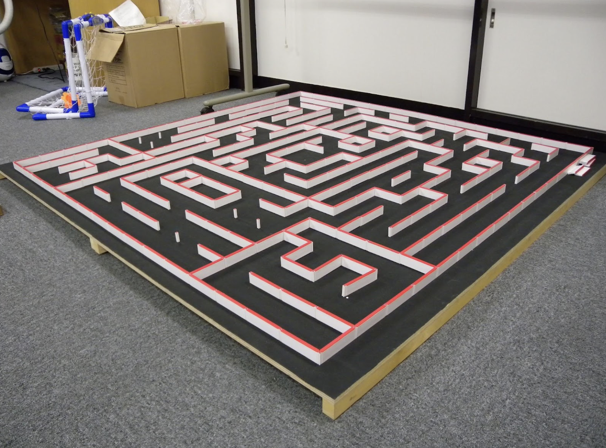

# Termo de Abertura do Projeto

> Termo de abertura do projeto / Project Charter. Um documento publicado pelo iniciador ou patrocinador do projeto que autoriza formalmente a existência de um projeto e fornece ao gerente do projeto a autoridade para aplicar os recursos organizacionais nas atividades do projeto.

## Visão Geral do Projeto

### Dados do projeto

* **Nome do Projeto:** Robo Labirinto
* **Data de Início:** 02/07
* **Data de Término:** 04/12
* **Patrocinador:** Universidade de Brasília

### Objetivos

- **Specific:** Desenvolver um robô autônomo (*micromouse*) capaz de mapear e resolver 3 labirintos de formatos desconhecidos **( 4x4, 8x4 e 12x4 )**, além de construir uma plataforma web para exibição da telemetria em tempo real (trajeto, bateria, velocidade, tempo) e persistência em banco de dados.
- **Measurable:**  
    - Resolver cada labirinto dentro do limite máximo de 10 minutos.
    - Obter a pontuação máxima de resolução (conclusão na 1ª tentativa para nota 10).
    - Exibir todos os dados de telemetria no sistema web para garantir o fator multiplicador 1,0 na avaliação.
    - Manter as dimensões físicas do robô estritamente abaixo do limite de **16,5cm x 16,5cm**.
- **Agreed:** Alinhado e acordado entre todos os integrantes da equipe multidisciplinar e os professores orientadores das turmas de Projeto Integrador 1 (FCTE/UnB).
- **Realistic:** Viável de ser executado com os conhecimentos integrados das engenharias da FCTE, contando com a construção prévia de uma pista de testes simplificada **4x4** para validação e ajuste do sistema antes das avaliações finais.
- **Time Bound:** Finalizar o projeto e apresentar a solução completa na avaliação final até a data limite de **04/12**, cumprindo todas as entregas intermediárias agendadas (AP2 a AP20).

### Público-Alvo

- **Professores e Avaliadores da FCTE/UnB:** Responsáveis por acompanhar o desenvolvimento, avaliar os entregáveis da disciplina e validar os testes de integração e a apresentação final.
- **Membros da Equipe de Engenharia:** Estudantes dos cursos de engenharia da FCTE que aplicarão conhecimentos de estruturas, energia, hardware e software.

### Descrição do Problema

A resolução autônoma de labirintos é um desafio clássico de engenharia que exige a integração multidisciplinar de engenharia de estruturas, energia, hardware e software. 

O robô deve ser projetado para navegar em células de **18cm** de lado, com paredes brancas de **5cm** de altura **1,2cm** de espessura (com topo vermelho) e chão preto. O veículo parte de um beco sem saída em um canto até a área objetivo no canto oposto. 

Existem restrições rígidas de projeto:

- Dimensões máximas de **16,5cm** de largura e comprimento (sem limite de altura).
- Proibição de voar, pular, escalar ou usar propulsão por combustão/foguetes.
- Proibição de alterar o código de computador ou a memória do robô durante a resolução do trajeto.
- Necessidade de transmitir dados de telemetria em tempo real para um sistema web próprio.

### Indicadores

> Listar até 10 indicadores que determinam o mercado consumidor do produto desenvolvido: exemplo: 1) nº de alunos da FGA que utilizam ônibus às 18:00; 2) nº de usuários do restaurante universitários, 3) número de idosos classificados como público-alvo no DF e no estado de Goiás, 4) nº de empresas de segurança registradas no DF etc.

### Membros da Equipe

| **Nome** | **Matrícula** | **Curso** | **E-mail** | **Funções** |
|----------|---------------|-----------|------------|-------------|
| [⁠Angel Daniel Grau Barreto](https://github.com/AngelDanielGrau) | 241025158 | Aeroespacial | angeldanielgrau@gmail.com | Estrutura |
| [⁠Angélica]( https://github.com/angelicaccampos ) | 221031256 | Software | angelicadacostacampos@gmail.com | Software |
| [⁠Ana Beatriz Souza Araújo](https://github.com/AnnaBeatrizAraujo) | 241025891 | Software | ana.araujo4519@gmail.com | Software |
| [⁠Ana Caroline](https://github.com/iicaroll) | 241025908 | Software | caroldantas211105@gmail.com | Energia |
| [⁠Carolina](https://github.com/carolinabecker ) | 241038450 | Software | carolsmbecker@gmail.com | Energia |
| [⁠Daniel  Henrique da Silva Rodrigues]( https://github.com/danielhdsrodrigues-pixel ) | 241038601 | Eletrônica | danielhdsrodrigues@gmail.com | Eletrônica |
| [⁠Edson](https://github.com/EdsonToppzera) | 242015826 | Software | edsongabrielbb@gmail.com | Software |
| [⁠Gabriel Mota Oliveira](https://github.com/Gabro-MO) | 241011081 | Software | gabriel1990mota@gmail.com | Software | 
| [⁠Giovana Rocha e Silva](https://github.com/GiovanaRocha16) | 242004715 | Software | giovanarocha160@gmail.com | Estrutura |
| [Gustavo Gomes Fornaciari]( https://github.com/GUGOFO ) | 241032519 | Software | gugofogomes@gmail.com | Eletrônica |
| [⁠Julia Japson Campos da Silveira]( https://github.com/juliajapson ) | 241011368 | Energia | juliajapson@gmail.com | Energia |
| [⁠Julia Patricio]( https://github.com/juliapat18 ) | 231027140 | Software | julia.patricio18@gmail.com | Estrutura |
| [⁠Laura](  ) |  |  |  |  |
| [⁠Lucas Fujimoto Tokunaga](https://github.com/Lucasft16) | 241025283 | Software | lucaasft16@gmail.com | Eletrônica |
| [⁠Nicolai Bukvar Miketen](https://github.com/NBukvar) |241025345|Eletrônica|nbmiketen@hotmail.com|Estrutura|
| [⁠Rafael Gomes Pereira](https://github.com/rafgpereira) | 222015248 | Software | rafaelgomespereira123@gmail.com | Software |
| [⁠Thomas Augusto Amorim de Araujo](https://github.com/Thomas4ugust0) | 251016027  | Software  | thomasgusto12@gmail.com | Eletrônica |

**Orientador:**

| **Nome** | **Turma** |
|----------|---------------|
| Prof. Diogo C. Garcia | 01 |
| Profa. Juliana P. Rodrigues | 02 |
| Prof. Lui T. C. Habl | 03 |
| Prof. Bruno L. Pereira | 04 |
| Prof. Hilmer Rodrigues Neri | 05 |

### Orçamento estimado (R$)

Discutam dentro da equipe a verba possível disponível para o desenvolvimento do projeto, com base na complexidade do projeto, na quantidade de membros e na realidade de cada um.

### Duração estimada (horas)

Estimem com sinceridade o tempo a ser despendido no desenvolvimento do projeto, com base na complexidade do projeto, na quantidade de membros e na realidade de cada um.
