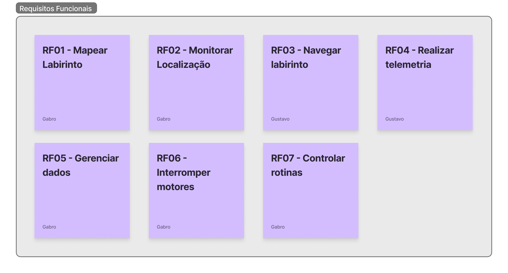
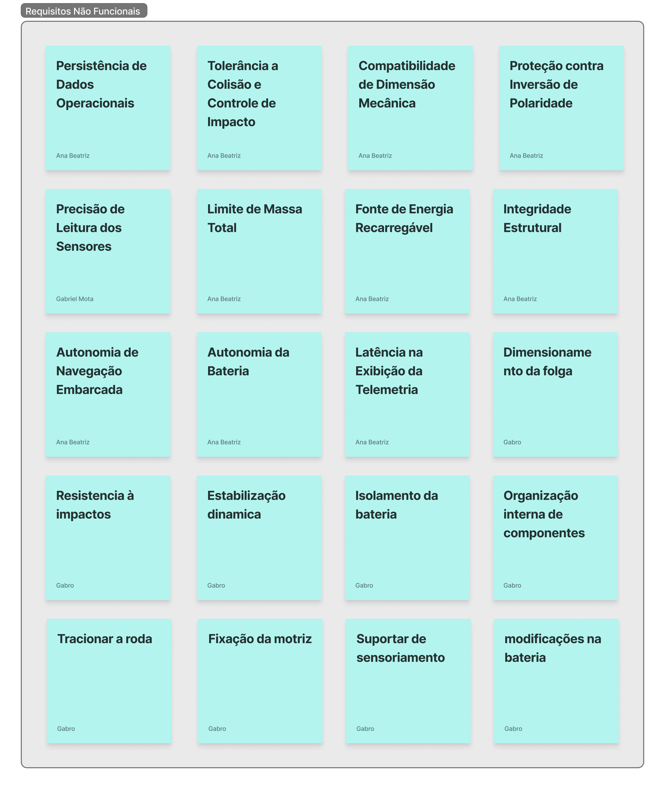
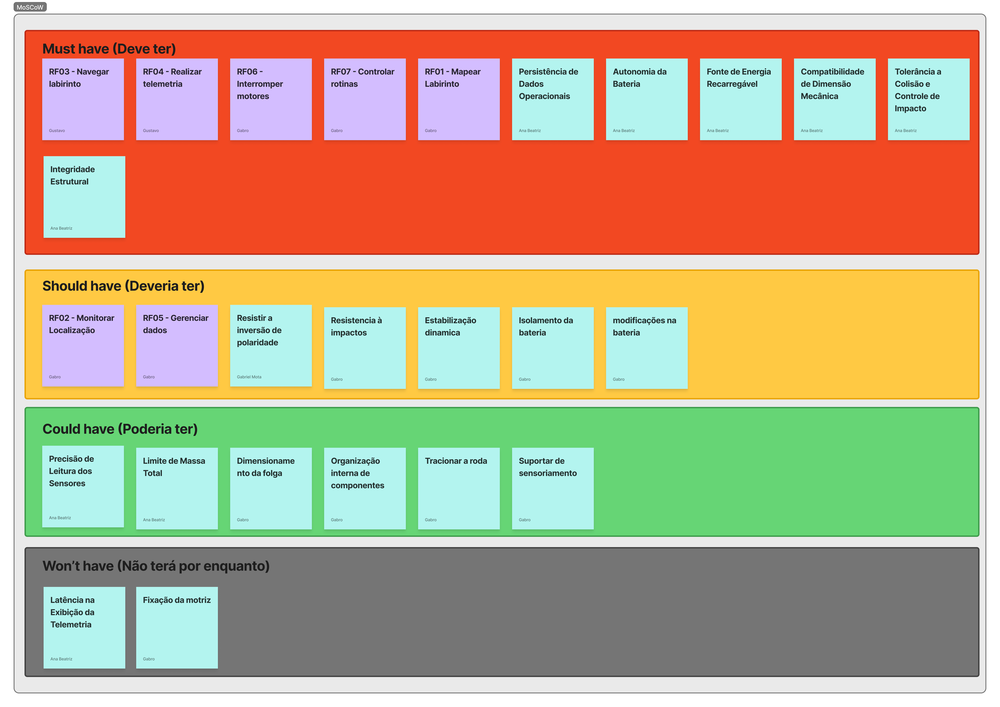
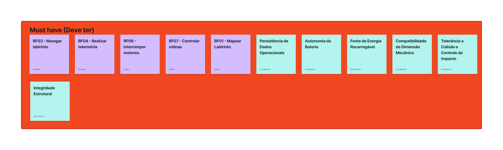
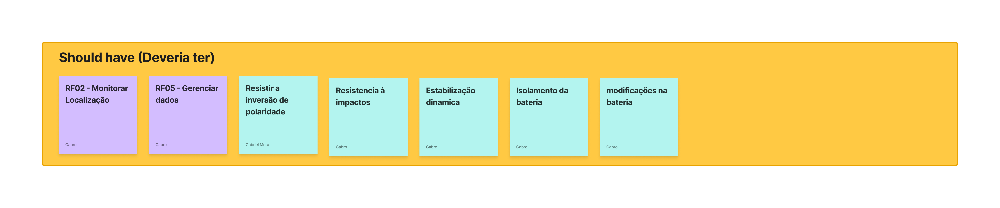
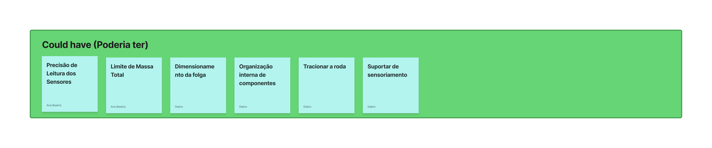
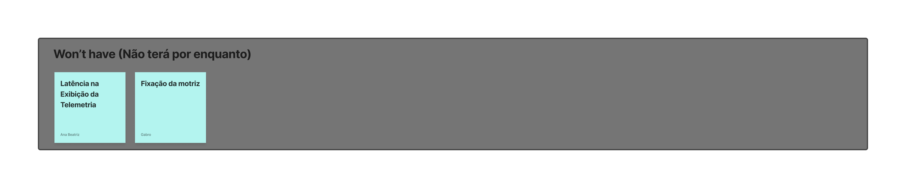
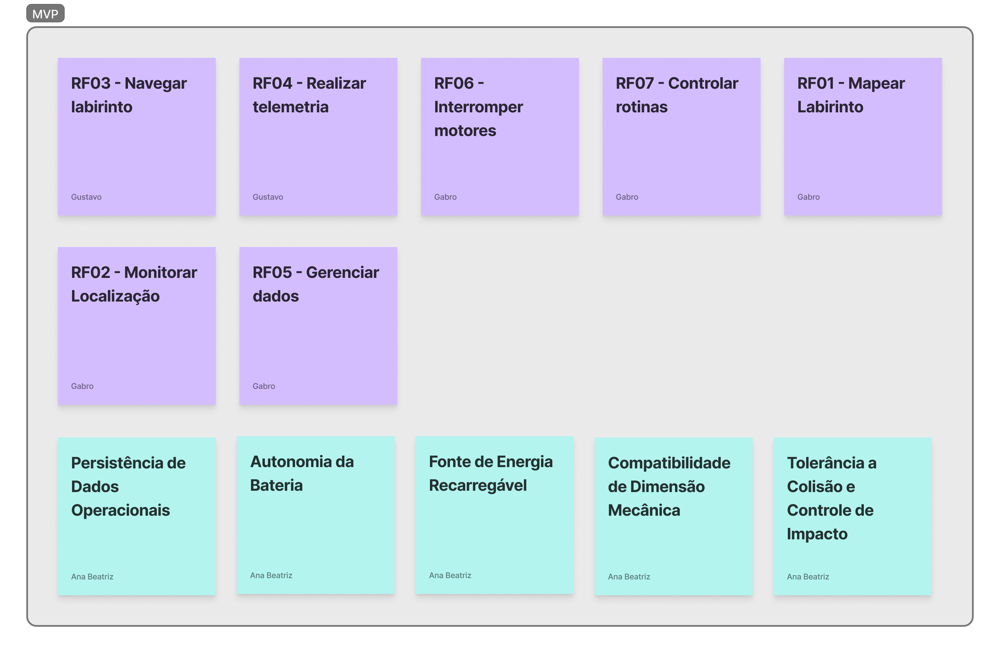

# Matriz de Rastreabilidade

Este documento consolida o painel interativo do Figma e a galeria de evidências visuais dos requisitos e da priorização MoSCoW do projeto MicroMouse.

## Painel do Figma completo

<iframe style="border: 1px solid rgba(0, 0, 0, 0.1);" width="800" height="450" src="https://embed.figma.com/board/f85GAXN5ue5UO5dhSWsyA4/Matriz-de-Rastreabilidade?node-id=0-1&embed-host=share" allowfullscreen></iframe> 

## Painel de Fotos

Aqui está a coleção de fotos detalhadas da matriz de rastreabilidade que fizemos no Figma para que facilite a visualização.

### Requisitos Funcionais

### Requisitos Não Funcionais

### MoSCoW

### Must Have

### Should Have

### Could Have

### Won’t have

### MVP

