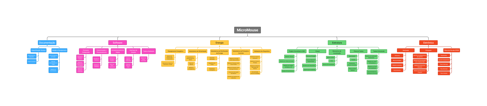
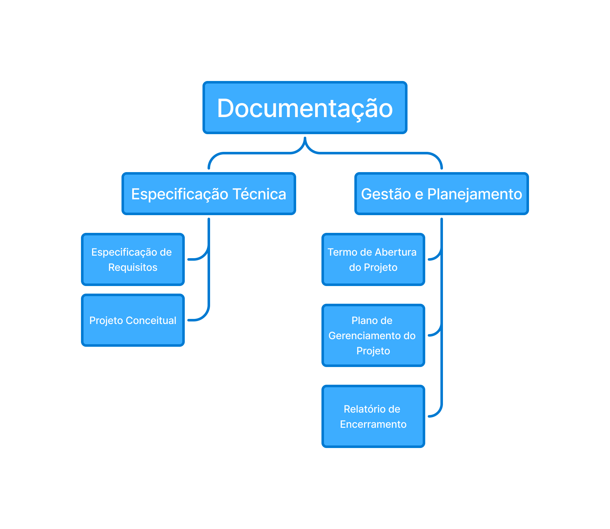
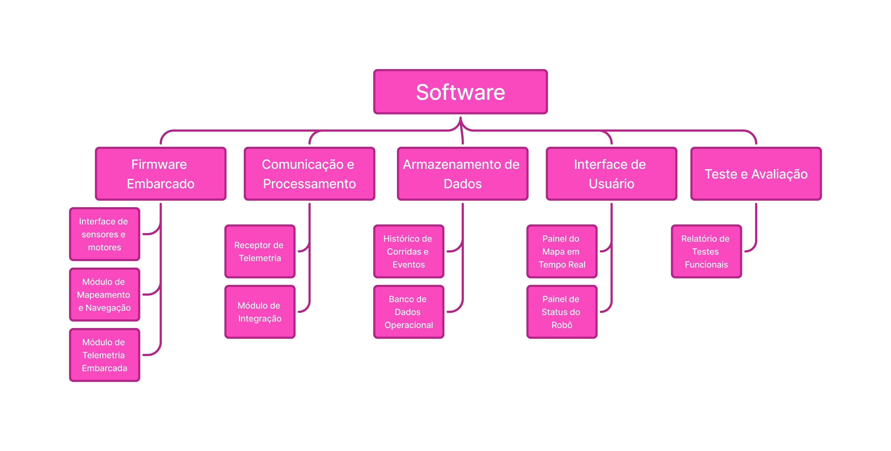
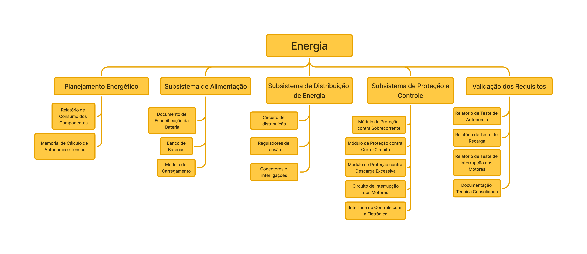
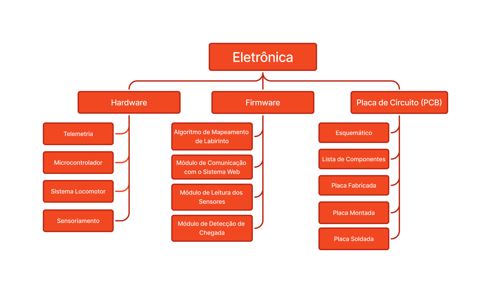
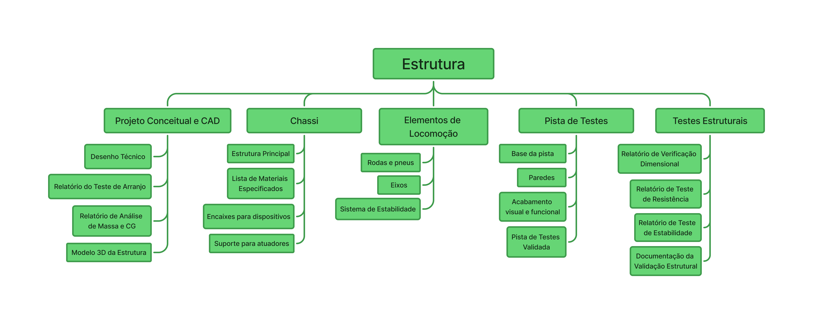

# Entrega Final: Estrutura Analítica do Projeto (EAP) - Projeto MicroMouse

Este documento apresenta a especificação técnica e a fundamentação metodológica da **Estrutura Analítica do Projeto (EAP)** desenvolvida para o projeto **MicroMouse**, alinhada rigorosamente às diretrizes acadêmicas da disciplina e às boas práticas de Gerenciamento de Projetos .

---

## 1. Fundamentos (O que é a EAP e como funciona)

Conforme a definição estabelecida para a disciplina:

> *A EAP representa a decomposição hierárquica do escopo total do trabalho a ser executado pela equipe do projeto a fim de alcançar os objetivos e criar entregas exigidas.* 

### Diretrizes e Regras de Elaboração
A EAP desenvolvida adota a abordagem por **Estrutura Analítica de Produto (EAP por Entregas)** . Para garantir a aderência às especificações do projeto e aos padrões formais, a estrutura atende rigorosamente às seguintes diretrizes :

1. **Exclusividade de Entregas e Pacotes de Trabalho:** A EAP contempla **somente entregas e pacotes de trabalho** . Todos os elementos são representados por substantivos ou produtos concluídos (ex.: "Relatório de Teste", "Desenho Técnico", "Modelo 3D") .
2. **Sem Associação às Fases do Projeto:** A EAP não é dividida pelas fases do ciclo de vida (como Iniciação, Planejamento, Execução ou Encerramento) . A decomposição é 100% orientada aos componentes e sub-entregas do produto .
3. **Sem Atividades:** Atividades, tarefas e verbos de ação pertencem ao cronograma do projeto e foram totalmente excluídos da EAP .
4. **Estrutura Hierárquica Pai-Filho (Regra 1):** Relação estritamente vertical e paralela do todo para as partes, sem ligações em série que representem fluxogramas ou sequenciamento cronológico .
5. **Regra dos 100% (Regras 3 e 4):** A soma de todos os pacotes de trabalho do nível inferior cobre 100% do escopo do nó pai, sem omissões e sem contabilizar nenhum trabalho duas vezes.
6. **Dimensionamento dos Pacotes (Regra 5):** Cada pacote de trabalho no nível mais baixo (folha) representa um esforço estimado entre 8 e 80 horas de trabalho .

---

## 2. EAP Completo

A EAP geral do projeto **MicroMouse** organiza todo o escopo do sistema no Nível 0 ("MicroMouse"), decompondo-o hierarquicamente em 5 módulos de entrega principais no Nível 1: Documentação, Software, Energia, Estrutura e Eletrônica.

### Visão Geral da Decomposição por Entregas
- **Nível 0:** MicroMouse
- **Nível 1 (Módulos de Entrega do Produto):**
  - **Documentação:** Artefatos formais de engenharia e gestão.
  - **Software:** Sistemas lógicos, firmware embarcado e interfaces de usuário.
  - **Energia:** Subsistemas de alimentação, regulação, distribuição e proteção elétrica.
  - **Estrutura:** Componentes mecânicos, chassi, locomoção e pista de validação.
  - **Eletrônica:** Circuitos impressos (PCB), hardware e sensoriamento.

---

## 3. Documentação

O módulo de **Documentação** engloba todos os documentos formais, especificações técnicas e planos produzidos para o projeto.

### Estrutura de Entregas e Pacotes de Trabalho
- **Documentação**
  - **Especificação Técnica**
    - Especificação de Requisitos
    - Projeto Conceitual
  - **Gestão e Planejamento**
    - Termo de Abertura do Projeto
    - Plano de Gerenciamento do Projeto
    - Relatório de Encerramento

---

## 4. Software

O módulo de **Software** especifica os pacotes de trabalho referentes à inteligência lógica embarcada, algoritmos, armazenamento de dados e interfaces visuais.

### Estrutura de Entregas e Pacotes de Trabalho
- **Software**
  - **Firmware Embarcado**
    - Interface de Sensores e Motores
    - Módulo de Mapeamento e Navegação
    - Módulo de Telemetria Embarcada
  - **Comunicação e Processamento**
    - Receptor de Telemetria
    - Módulo de Integração
  - **Armazenamento de Dados**
    - Histórico de Corridas e Eventos
    - Banco de Dados Operacional
  - **Interface de Usuário**
    - Painel do Mapa em Tempo Real
    - Painel de Status do Robô
  - **Teste e Avaliação**
    - Relatório de Testes Funcionais

---

## 5. Energia

O módulo de **Energia** organiza os pacotes de trabalho relacionados ao fornecimento, regulação, segurança e testes de eficiência energética do robô.

### Estrutura de Entregas e Pacotes de Trabalho
- **Energia**
  - **Planejamento Energético**
    - Relatório de Consumo dos Componentes
    - Memorial de Cálculo de Autonomia e Tensão
  - **Subsistema de Alimentação**
    - Documento de Especificação da Bateria
    - Banco de Baterias
    - Módulo de Carregamento
  - **Subsistema de Distribuição de Energia**
    - Circuito de Distribuição
    - Reguladores de Tensão
    - Conectores e Interligações
  - **Subsistema de Proteção e Controle**
    - Módulo de Proteção contra Sobrecorrente
    - Módulo de Proteção contra Curto-Circuito
    - Módulo de Proteção contra Descarga Excessiva
    - Circuito de Interrupção dos Motores
    - Interface de Controle com a Eletrônica
  - **Validação dos Requisitos**
    - Relatório de Teste de Autonomia
    - Relatório de Teste de Recarga
    - Relatório de Teste de Interrupção dos Motores
    - Documentação Técnica Consolidada

---

## 6. Eletrônica

O módulo de **Eletrônica** compreende a infraestrutura de hardware, sensores, atuadores e placas de circuito impresso (PCB).

### Estrutura de Entregas e Pacotes de Trabalho
- **Eletrônica**
  - **Hardware**
    - Telemetria
    - Microcontrolador
    - Sistema Locomotor
    - Sensoriamento
  - **Firmware**
    - Algoritmo de Mapeamento de Labirinto
    - Módulo de Comunicação com o Sistema Web
    - Módulo de Leitura dos Sensores
    - Módulo de Detecção de Chegada
  - **Placa de Circuito (PCB)**
    - Esquemático
    - Lista de Componentes
    - Placa Fabricada
    - Placa Montada
    - Placa Soldada

---

## 7. Estrutura

O módulo de **Estrutura** reúne as entregas físicas de engenharia mecânica, chassi, locomoção e a pista física de testes.

### Estrutura de Entregas e Pacotes de Trabalho
- **Estrutura**
  - **Projeto Conceitual e CAD**
    - Desenho Técnico
    - Relatório do Teste de Arranjo
    - Relatório de Análise de Massa e CG
    - Modelo 3D da Estrutura
  - **Chassi**
    - Estrutura Principal
    - Lista de Materiais Especificados
    - Encaixes para Dispositivos
    - Suporte para Atuadores
  - **Elementos de Locomoção**
    - Rodas e Pneus
    - Eixos
    - Sistema de Estabilidade
  - **Pista de Testes**
    - Base da Pista
    - Paredes
    - Acabamento Visual e Funcional
    - Pista de Testes Validada
  - **Testes Estruturais**
    - Relatório de Verificação Dimensional
    - Relatório de Teste de Resistência
    - Relatório de Teste de Estabilidade
    - Documentação da Validação Estrutural
