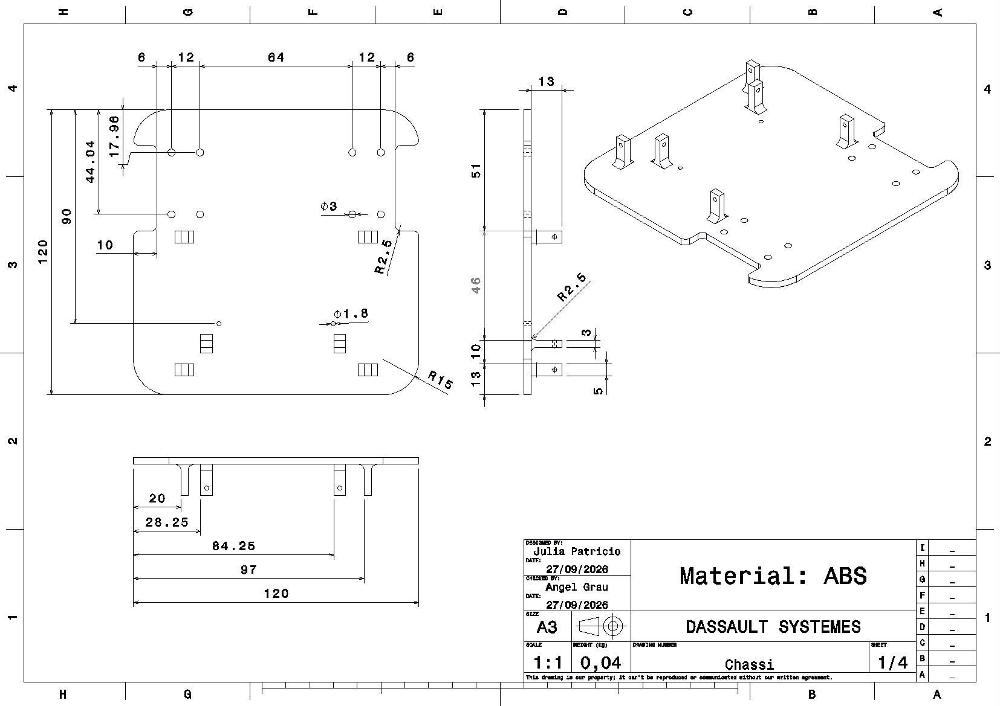
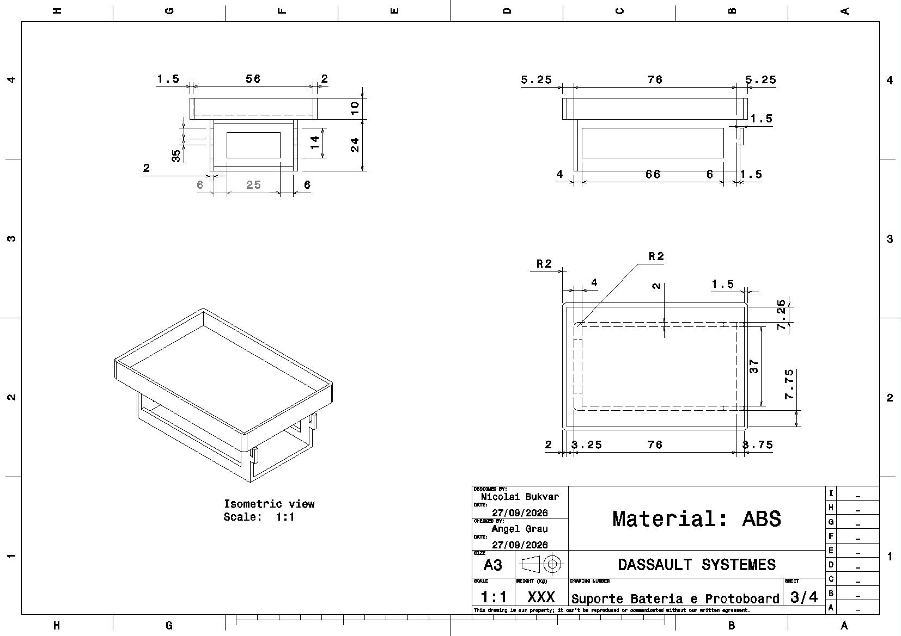
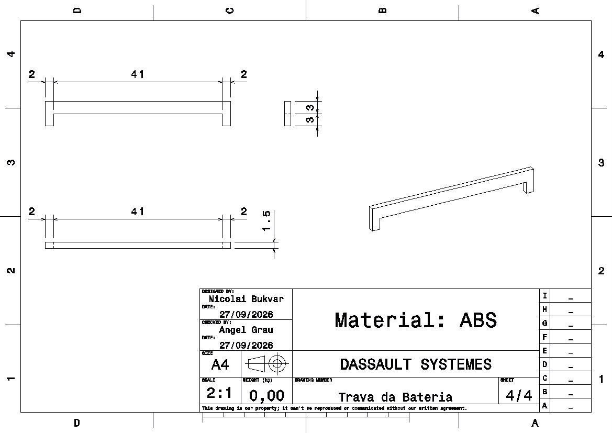
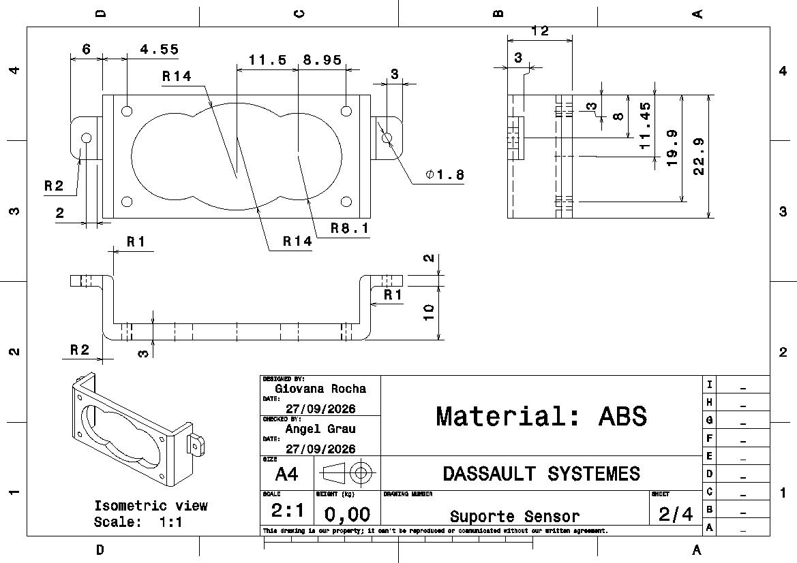

# Projeto Conceitual da Estrutura do Produto — Micromouse

## Sumário
1. [Desenho em CAD](#1-desenho-em-cad)
2. [Dimensões](#2-dimensões-lados-arestas-e-cotas)
3. [Materiais Utilizados](#3-materiais-utilizados)
4. [Partes Fundamentais](#4-partes-fundamentais)
5. [Explicação do Desenho](#5-explicação-do-desenho)
6. [Justificativa das Decisões de Projeto](#6-justificativa-das-principais-decisões-de-projeto)
7. [Tabela Resumo de Decisões](#7-tabela-resumo-de-decisões)
8. [Rastreabilidade: Decisões × Requisitos](#8-rastreabilidade-decisões--requisitos)

---

## 1. Desenho em CAD

CAD do carrinho

Print da vista isométrica tirada direto do CATIA V5. Nota-se os componentes desenvolvidos pelo grupo (chassi, suportes e travas), além de componentes tirados do GrabCAD para facilitar a visualização (motores, sensores, protoboard). Compreende-se que esses componentes tirados do GrabCAD não correspondem ao tamanho real das peças, por isso, foram utilizados apenas para ilustração e é esperado algumas discordâncias.

---

Desenho do Chassi

O Chassi foi projetado com o objetivo de suportar tanto a parte de hardware e bateria, quanto as rodas e os demais suportes. Tendo isso em vista, os recortes laterais foram feitos para o encaixe das rodas;motores e os suportes para garantir a estabilidade dos sensores. A parte central posterior foi dedicada à bateria e protoboard.

---

Desenho do suporte da bateria e protoboard

O suporte da bateria e da protoboard é a parte mais crítica, pois deve acomodar com cuidado o "cérebro" e a fonte energética do projeto. Pensando nisso, projetou-se uma estrutura de dois andares: o primeiro responsável por abrigar a bateria e o segundo por abrigar a protoboard e demais componentes eletrônicos necessários. Visando o fácil acesso, mas mantendo a confiabilidade, o compartimento da bateria é aberto na parte traseira e o compartimento da protoboard é aberto para cima. As aberturas laterais do primeiro andar foram projetadas para permitir a livre passagem de fios.

---

Desenho da trava da bateria

Como comentado anteriormente, o compartimento da bateria é vazado atrás, portanto, se vê necessário um sistema de trava por encaixe no próprio compartimento da bateria.

---

Desenho do suporte do sensor

O sensor escolhido pela parte de hardware exige estabilidade para uma leitura confiável, logo, viu-se necessário o desenvolvimento de um suporte para o sensor. Nota-se que ele se encaixa direto nos suportes do chassi.

CONSIDERAÇÕES: Entende-se que o atual projeto conceitual está suscetível à alterações e melhorias. Os eixos, rodas, ball caster, suporte do motor e parafusos deverão ser adquiridos e não produzidos pelo grupo visando a maior previsibilidade e/ou devido aos argumentos apresentados neste projeto conceitual.

---

## 2. Dimensões (lados, arestas e cotas)

**Chassi**
| Cota | Valor |
|---|---|
| Lado do chassi | 11–12 cm |
| Espaço livre entre paredes | 18 cm |
| Diagonal (12 cm de lado) | ≈ 16,97 cm |
| Folga de giro (180°) | ≈ 1 cm |
| Espessura da base (ABS) | 2–3 mm |

*RF-EST-02: giro de 180° dentro de 18 cm exige lado ≤ 18/1,41 ≈ 12,7 cm → daí os 11–12 cm adotados.*

**Rodas:** Ø 34 mm, largura 6,5 mm, eixo D-shaft 3 mm, ≈3,2 g cada.

**Referências:** bateria 18650 (2S, 7,4 V) ≈ 70×35×20 mm; motor N20 corpo 24×12×10 mm.

---

## 3. Materiais Utilizados

| Componente | Material | Justificativa | Onde comprar |
|---|---|---|---|
| Chassi/plataforma/suportes | ABS Premium (MG-94) | Resistência térmica/impacto, baixo empenamento | [ABS (lojanational3d)](https://www.lojanational3d.com.br/filamentoabspremiummg-94pretopiano175mm1kg/prod-7395594/) |
| Rodas motrizes | Borracha (comprada) | Aderência — ABS impresso derrapa | [Rodas (Mercado Livre)](https://www.mercadolivre.com.br/2x-roda-34mm-para-micro-motor-dc-12v-n20-robo/up/MLBU664879255) |
| Cubo eixo-roda | ABS impresso | Só o adaptador é impresso, nunca a roda | [ABS (lojanational3d)](https://www.lojanational3d.com.br/filamentoabspremiummg-94pretopiano175mm1kg/prod-7395594/) |
| Ball caster | Aço Carbono | Resistência e maior confiabilidade | [Ball caster (Mercado Livre)](https://www.mercadolivre.com.br/esfera-transferidora-aco-carbono-roda-boba-para-robotica/up/MLBU2884521198#polycard_client=search-desktop&be_origin=backend&overlay_label=not_apply&search_layout=grid&position=17&type=product&tracking_id=9f1a3af4-0517-4f8f-9862-8200c482e2cb&wid=MLB5208198818&sid=search) |

| Propriedade | PLA | PETG | ABS conv. | ABS Premium |
|---|---|---|---|---|
| Densidade (g/cm³) | 1,24 | 1,27 | 1,04–1,07 | ~1,04 |
| Resist. impacto | Baixa | Boa | Boa a alta | Boa a alta |
| Resist. térmica | ~55–60°C | ~70–80°C | ~95–100°C | ~95–105°C |
| Empenamento | Baixa | Baixa/mod. | Alta | Reduzida |
| Uso no projeto | Protótipos | Chassi/suportes | Peças estrut. | Chassi/suportes |

**Material final:** ABS Premium (National 3D, R$124,69) — melhor equilíbrio rigidez × empenamento para peças estruturais.

**Por que ABS (e não PLA/PETG):** o chassi está sujeito a vibração dos motores, colisões ocasionais com paredes e esforços concentrados nos pontos de fixação — cenário que pede resistência mecânica, ao impacto e estabilidade térmica. O ABS entrega esse equilíbrio e, por não ser condutor, não interfere no sinal do módulo de telemetria. PLA tem menor resistência térmica/impacto (limita uso estrutural); PETG é uma alternativa viável, mas o ABS Premium (MG-94) foi preferido por maior estabilidade dimensional e melhor processabilidade — favorecendo encaixes e tolerâncias finas nos suportes de motores, compartimento de bateria e pontos de montagem da eletrônica, além de facilitar pós-processamento e acabamento.

---

## 4. Partes Fundamentais

- **Chassi (2 andares):** Andar 1 (base) — sensores ultrassônicos, motores, bateria centralizada no eixo de tração, ball caster na extremidade oposta. Andar 2 — protoboard, ESP32 e DRV8833 centralizados.
- **Tração/rodas:** 2 rodas motorizadas internas ao contorno (protege de impactos, não atrapalha sensores, preserva diagonal de giro); eixo levemente deslocado para trás, compensando o peso da eletrônica no andar superior.
- **Roda de apoio:** ball caster em aço, apoio de 3 pontos.
- **Compartimento de bateria:** acessível/substituível sem desmontagem total, com abertura para recarga sem desmontar o robô, isolamento interno contra contato condutor e encaixe anti-inversão de polaridade (só entra de um jeito).
- **Pontos de fixação dos sensores:** os 3 sensores ultrassônicos possuem encaixe dedicado, sem obstruir o campo de leitura e sem folga/vibração que degrade a medição.
- **Pontos de fixação dos motores:** os 2 motores possuem encaixe dedicado, sem interferir no compartimento de bateria.
- **Suporte de Motor:** os 2 suportes de motor serão impressos em ABS premium utilizando modelo do printables.

---

## 5. Explicação do Desenho

- **Andar 1 (topo):** 3 sensores ultrassônicos voltados para frente/laterais, bateria central alinhada ao eixo de tração, ball caster na extremidade posterior, motores.
- **Andar 2 (topo):** protoboard ocupando a maior área, ESP32 e DRV8833 centralizados para cabeamento curto.
- **Rodas** internas ao contorno, próximas à borda traseira; ball caster oposta, formando tripé estável.

---

## 6. Justificativa das Principais Decisões de Projeto

**Chassi 11–12 cm:** limite geométrico de giro (diagonal × √2 ≤ 18 cm) com folga de ~1 cm, ainda maior com cantos arredondados.

**Ball caster vs. caster de eixo giratório:**
| Critério | Caster giratório | Ball caster |
|---|---|---|
| Alinhamento ao virar | Atraso ("swing") | Livre, sem atraso |
| Footprint no giro | Varia com o pivô | Fixo e simétrico |
| Erro odométrico | Maior | Menor |

→ Ball caster reduz o erro odométrico nos giros de 180°, requisito crítico.

**Rodas compradas:** ABS impresso não tem aderência suficiente e o encaixe D-shaft exige tolerância fina (evita folga/vibração no encoder); peças compradas garantem balanceamento. Só o cubo adaptador é impresso.

**Rodas internas ao chassi:** mantém a diagonal de giro do próprio chassi, evita interferência com sensores laterais e protege as rodas de impactos.

**Ball caster fechada:** ambiente controlado e uso curto (30 min/3 percursos) reduzem o risco de sujeira/atrito inconsistente, compensando a simplicidade de custo.

**Dois andares:** separa bateria (peso concentrado no eixo de tração, reduz tombamento) da eletrônica (mais leve, andar superior), preservando distribuição de massa e organização interna.

**Eixo deslocado para trás:** distribuição dos componentes baseado na otimização da telemetria compensa o peso da eletrônica concentrada mais à frente/centro no andar superior.

**Material ABS Premium:** melhor resistência térmica/tração e menor empenamento que o ABS convencional — mantém a precisão dimensional das peças estruturais.

---

## 7. Tabela Resumo de Decisões

| Item | Decisão |
|---|---|
| Tamanho do chassi | 11–12 cm de lado, quadrado com cantos arredondados |
| Configuração de rodas | 2 motorizadas + 1 ball caster |
| Posição das rodas | Internas ao contorno do chassi |
| Fabricação das rodas | Compradas (roda de borracha p/ N20, 34 mm) |
| Ball caster | Esfera de aço comprada |
| Arquitetura | 2 andares (base: sensores + bateria + motores; superior: protoboard + eletrônica) |
| Eixo das rodas | Levemente deslocado para trás do centro geométrico |
| Material | ABS Premium — National 3D |

---

## 8. Rastreabilidade: Decisões × Requisitos

| Decisão | Requisito(s) | Justificativa |
|---|---|---|
| Chassi quadrado, 11–12 cm, cantos arredondados | RNF-04 | Diagonal (lado×√2) precisa caber nos 18 cm livres para o giro de 180°; 12 cm → diagonal ≈16,97 cm, folga ≈1 cm considerando tolerância de fabricação |
| Material ABS (preferencialmente Premium MG-94) | RNF-06 | Boa resistência a impacto/temperatura, suporta colisões e os 30 min/3 percursos sem deformar; não condutor, não interfere na telemetria |
| Tração: 2 rodas motorizadas + ball caster | RF-07; RNF-08 | Ball caster rola livre em qualquer direção sem atraso de alinhamento, reduzindo erro odométrico e melhorando estabilidade dinâmica |
| Rodas (34 mm, borracha p/ N20) | RNF06 | ABS impresso não tem aderência suficiente e o encaixe D-shaft exige tolerância fina que a impressão não garante |
| Rodas internas ao contorno do chassi | RNF04; RF04 | Não soma largura à diagonal de giro, evita interferência com sensores laterais e protege as rodas de impactos diretos |
| Ball caster fechada | RNF06 | Rolamento exposto acumula sujeira/atrito inconsistente; risco mitigado pelo ambiente controlado e uso curto exigidos pelo RNF-11 |
| Arquitetura em 2 andares | RNF02; RNF03 | Acomoda bateria e eletrônica sem comprometer a distribuição de massa nem a organização interna |
| Bateria centralizada no eixo das rodas (andar 1) | RNF02; RNF03 | Mantém o centro de massa mais pesado alinhado ao eixo de tração, reduzindo tombamento em giros |
| Eixo das rodas deslocado para trás | RNF02; RNF03 | Compensa o peso da eletrônica concentrada no andar superior, mais à frente/centro |
| Cantos internos arredondados em furos/canaletas | RNF06 | Evita cisalhar o isolamento dos fios com a vibração ao longo da operação |
| Compartimento de bateria acessível + abertura para recarga | RNF02; RNF03 | Troca entre tentativas sem desmontagem completa e recarga sem desmontar o robô |
| Isolamento interno do compartimento de bateria | RNF-06 | Isola fisicamente a bateria de contato condutor indesejado com a estrutura |
| Pontos de fixação para os 3 sensores ultrassônicos | RF-04 | Fixação sem obstruir o campo de detecção e sem folga/vibração que degrade a leitura |
| Fabricação por impressão 3D, com tolerância de folga | RNF04 | O dimensionamento da folga entre robô e paredes já considera a tolerância de fabricação/montagem |
