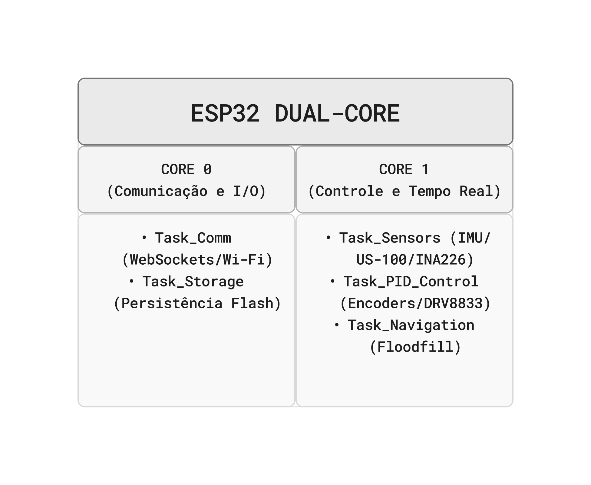
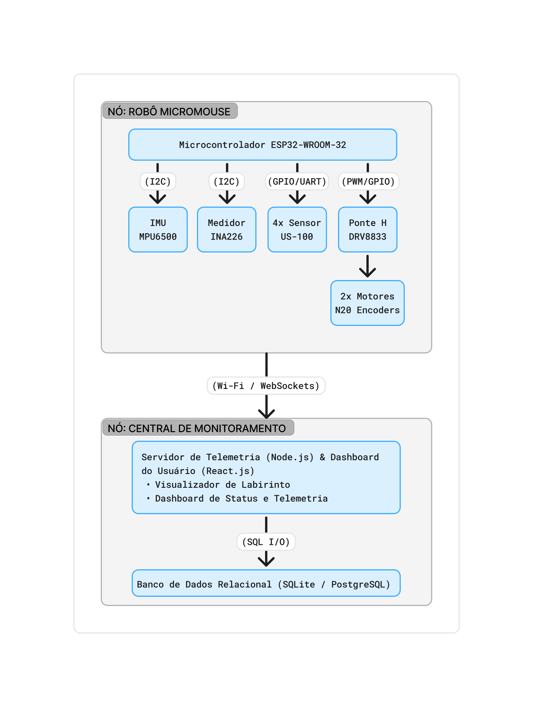
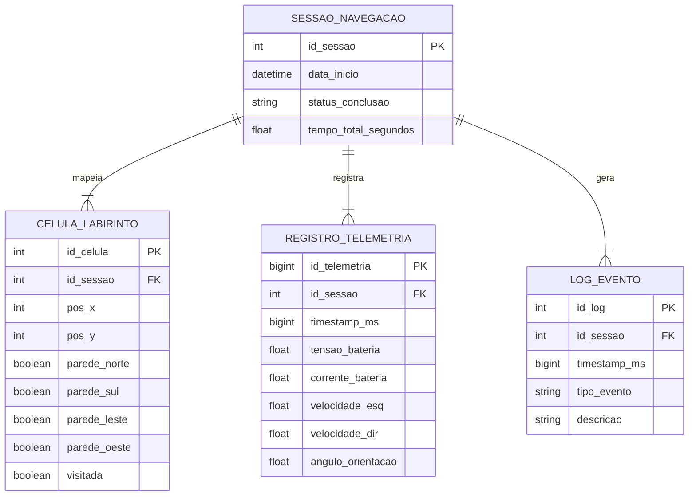

# Projeto Conceitual de Software

- [Explicações adicionais](https://drive.google.com/file/d/1WWIz6609c7Y7zAQRBWHSbX0t2vEJ2z1A/view?usp=sharing)
- [Noções de UML](https://drive.google.com/file/d/1l1yt2ittHuRKIXVXYT76P1HriR07pK-t/view?usp=sharing)
- [Requisitos](https://engsoftmoderna.info/cap3.html)

## Diagrama de Atividades

O diagrama abaixo descreve o fluxo de comportamento funcional do MicroMouse durante uma corrida,
desde o início da execução até a chegada ao objetivo, evidenciando os três atores envolvidos
(raias/_swimlanes_): o **Robô** (firmware embarcado), o **Servidor** (sistema web de telemetria +
banco de dados) e o **Usuário** (que acompanha a corrida pelo dashboard).

## Diagrama de Atividades no Figma

<iframe style="border: 1px solid rgba(0, 0, 0, 0.1);" width="800" height="450" src="https://embed.figma.com/board/TayFIuY1BoFhklOIzuSOSx/PI1---Diagrama-de-Atividades?node-id=2-8&embed-host=share" allowfullscreen></iframe>

**Leitura do fluxo:**

- **Entradas:** Leituras dos sensores de distância a cada célula percorrida e calibração inicial do sistema.
- **Atividades do Robô:** Inicialização do sistema, mapeamento e atualização da localização do robô, decisão do próximo movimento e execução da navegação.
- **Ponto de decisão:** "Atingiu a saída?" separa o ciclo de navegação e tomada de decisão da etapa de encerramento da corrida.
- **Sincronização e Paralelismo:** A cada movimento executado, o robô dispara em segundo plano a transmissão de dados de telemetria para a Plataforma Web, mantendo o laço de navegação ativo de forma paralela.
- **Atividades da Plataforma Web:** Recebimento dos pacotes de telemetria, salvamento dos dados no banco de dados e atualização da interface do dashboard em tempo real.
- **Atividades do Usuário:** Acompanhamento da corrida ao vivo no dashboard e análise do relatório final de desempenho ao término do percurso.
- **Saídas:** Dados da corrida armazenados localmente no MicroMouse, histórico completo persistido no banco de dados e relatório exibido no dashboard web.

> **Itens fundamentais:**
>
> - **Diagrama Atividades UML:** descrever e explicar o fluxo do comportamento funcional do produto proposto, evidenciando, de forma clara e estruturada, como as atividades são executadas, em que ordem e sob quais condições. Esse diagrama permite compreender o funcionamento dinâmico do sistema, destacando:
>   - os principais atores (usuários ou sistemas externos) envolvidos no processo;
>   - as atividades de negócio realizadas por cada ator ou pelo próprio sistema;
>   - os insumos (entradas) necessários para a execução das atividades;
>   - os resultados (saídas) gerados ao longo do fluxo;
>   - os pontos de decisão, paralelismo e sincronização das atividades;
>   - Entre as notações mais relevantes, destacam-se o estado inicial e final, atividades, nós de decisão e junção, barras de bifurcação, Raias (_swimlanes_) e Fluxos de controle.
> - **_Backlog_ do Produto**
>   - Detalhar os requisitos funcionais (RF) com a técnica de documentação e especificação de história de usuário (HU);
>   - Protótipos de interface gráfica do _software_ em alta fidelidade.
>     - **Todas HUs devem conter sua descrição (Eu-Como-Para), critérios de aceitação e protótipos de interface, documentadas no github.**
>   - Exporte as informações do Backlog do Produto no GitHub Projects [em formato CSV](https://docs.github.com/en/issues/planning-and-tracking-with-projects/managing-your-project/exporting-your-projects-data), e [renderize em Markdown](https://www.google.com/search?q=convert+CSV+file+to+Markdown+table) no formato a seguir:

### Requisitos Funcionais

<u>RF-00/Épico-00: Título do RF/Épico</u>

| ID (Link Github Projects) | Título | Prioridade |
| :------------------------ | :----- | :--------- |
| HU-00                     |        |            |
| HU-01                     |        |            |
| HU-02                     |        |            |

<u>RF-01/Épico-01: Título do RF/Épico</u>

| ID (Link Github Projects) | Título | Prioridade |
| :------------------------ | :----- | :--------- |
| HU-03                     |        |            |
| HU-04                     |        |            |
| HU-05                     |        |            |

### Requisitos Não-Funcionais

| ID (Link Github Projects) | Título | Prioridade | Rastreabilidade |
| :------------------------ | :----- | :--------- | :-------------- |
| RNF-01                    |        |            | RF-00/HU-00     |
| RNF-02                    |        |            |                 |
| RNF-03                    |        |            |                 |

# Arquitetura de Software: Solução MicroMouse

Este documento apresenta a especificação arquitetural do sistema embarcado e da central de monitoramento para o robô **MicroMouse**, estruturado de acordo com o modelo de **Visões Arquiteturais (4+1)** do Processo Unificado (UP). Em conformidade com as diretrizes do projeto, a tradicional _Visão de Casos de Uso_ foi substituída pela **Visão de Dados**.

---

## 1. Visão Geral e Propósito do Software

### 1.1 Propósito do Software

O software possui o papel de atuar como o **sistema de controle autônomo e telemetria de bordo** do robô MicroMouse. Ele é responsável por:

- Processar sinais de sensores em tempo real para identificação de paredes, localização e orientação.

- Executar algoritmos de navegação e mapeamento dinâmico do labirinto.

- Controlar os atuadores (motores via controle PID e odometria) para movimentação precisa.

- Persistir e transmitir dados de telemetria, logs de execução e a topologia do labirinto para uma central de controle via Wi-Fi em tempo real.

---

## 2. Visão Lógica

A Visão Lógica descreve a organização conceitual e a estruturação das classes e módulos do sistema.

### 2.1 Padrões Arquiteturais Adotados e Justificativa

- Firmware Embarcado (Robô): Arquitetura em Camadas (Layered Architecture) orientada a Eventos/Tarefas.
  - **Justificativa:** O software de bordo lida diretamente com o hardware do microcontrolador ESP32. A divisão em camadas garante o desacoplamento entre os drivers de baixo nível (I2C, PWM, GPIO), a lógica de controle PID/Navegação e a camada de comunicação de alto nível.

- Dashboard (Central de Controle): Padrão MVC (Model-View-Controller).
  - **Justificativa:** Permite a separação entre a interface visual que renderiza o labirinto e métricas do robô (**View**), os serviços que processam as mensagens WebSockets recebidas (**Controller**) e os modelos de dados da sessão e estado (**Model**).

### 2.2 Divisão em Módulos do Sistema

1. Módulo HAL / Drivers de Hardware (Baixo Nível):
   - _Driver IMU (MPU6500):_ Leitura do giroscópio e acelerômetro via I2C para estimativa de orientação.

   - _Driver Ultrassônico (US-100):_ Leitura contínua da distância de paredes via UART/GPIO.

   - _Driver Ponte H (DRV8833):_ Controle PWM para acionamento dos motores N20.

   - _Driver de Odometria (Encoders N20):_ Contagem de pulsos por interrupção para cálculo de deslocamento.

   - _Driver de Potência (INA226):_ Monitoramento de tensão e corrente da bateria via I2C.

2. Módulo de Controle e Navegação (Médio Nível):
   - _Malha de Controle PID:_ Mantém o robô centralizado e estabilizado durante a locomoção.

   - _Mapeador e Buscador (Floodfill):_ Atualiza a matriz do labirinto e calcula as ações de rotação e avanço.

3. Módulo de Comunicação e Armazenamento (Alto Nível):
   - _Gerenciador NVS/Flash:_ Armazena configurações e histórico de logs localmente.

   - _Servidor WebSockets/Wi-Fi:_ Transmite a telemetria do robô e atualizações do mapa.

---

## 3. Visão de Processos

A Visão de Processos trata da concorrência, tempo real e distribuição do processamento entre as tarefas do sistema.

O microcontrolador **ESP32** conta com dois núcleos de processamento (Core 0 e Core 1) e executa o sistema operacional de tempo real **FreeRTOS**. As tarefas (_Tasks_) são distribuídas entre os núcleos para garantir resposta imediata aos sensores sem bloquear as rotinas de comunicação:

- **Processo 1: `Task_Sensors` (Periódico - 10ms | Prioridade Alta):**
  - Executa a amostragem do giroscópio MPU6500 e a leitura dos 4 sensores US-100 para identificação imediata de obstáculos/paredes.

- **Processo 2: `Task_PID_Control` (Periódico - 5ms | Prioridade Máxima):**
  - Processa interrupções dos leitores de encoder dos motores N20, calcula os erros de trajetória e atualiza o ciclo de trabalho PWM da ponte H DRV8833.

- **Processo 3: `Task_Navigation` (Baseado em Eventos | Prioridade Média):**
  - Disparada quando o robô alcança o centro de uma célula. Executa a lógica de atualização da grade de navegação e decide a próxima direção.

- **Processo 4: `Task_Comm` (Assíncrono | Prioridade Baixa):**
  - Formata os dados no formato JSON e envia pacotes de telemetria e o estado do labirinto para a central de controle via WebSockets.

---

## 4. Visão de Implementação

A Visão de Implementação especifica as tecnologias, linguagens, frameworks e bibliotecas escolhidas para a solução.

### 4.1 Tecnologias Adotadas

| Camada                            | Tecnologia / Linguagem      | Frameworks e Bibliotecas                                                             | Justificativa                                                                                                                            |
| --------------------------------- | --------------------------- | ------------------------------------------------------------------------------------ | ---------------------------------------------------------------------------------------------------------------------------------------- |
| **Firmware (Embarcado)**          | **C++ / C**              | FreeRTOS, Arduino ESP32 Core, `Wire.h` (I2C), `ESPAsyncWebServer`, `ArduinoJson`  | Permite controle rigoroso de baixo nível, acesso direto aos registradores e periféricos da ESP32 com altíssimo desempenho de tempo real. |
| **Dashbord (Backend/Server)**     | **TypeScript / Node.js**    | Express.js, `ws` (WebSockets), TypeORM / Prisma                                      | Plataforma leve e eficiente em I/O assíncrono para manipulação da transmissão contínua de dados de telemetria.                           |
| **Dashbord (Frontend/Dashboard)** | **TypeScript / JavaScript** | React.js, TailwindCSS, Chart.js, HTML5 Canvas API                                    | Permite renderização fluida da grade do labirinto em tempo real e atualização gráfica das métricas do robô.                              |

---

## 5. Visão de Implantação

A Visão de Implantação descreve a arquitetura física e a topologia de hardware da solução.

### Componentes de Hardware Utilizados e Conexões:

1. **ESP32 DevKit 30 Pinos:** Unidade Central de Processamento.

2. **Ponte H DRV8833:** Conectada às saídas PWM da ESP32 para controle bidirecional dos Motores N20-6V.

3. **2x Motores N20 com Encoders:** Conectados a pino de interrupção da ESP32 para feedback de malha fechada.

4. **4x Sensores Ultrassônicos US-100:** Dispostos nas posições frontal, traseira, esquerda e direita para mapeamento de paredes.

5. **IMU MPU6500:** Conectado via barramento I2C para estimativa de ângulo e giros precisos de 180°.

6. **Sensor INA226:** Conectado via I2C para leitura de corrente e tensão da bateria.

7. **Regulador Buck MP1584:** Regula a tensão de alimentação dos módulos lógicos.

---

## 6. Visão de Dados

A Visão de Dados descreve a modelagem e a estrutura de persistência das informações manipuladas e gravadas pelo sistema.

### 6.1 Escolha da Tecnologia de Banco de Dados: **Relacional (SQLite / PostgreSQL)**

- **Justificativa:** Os dados manipulados pelo sistema possuem um alto grau de estruturação e esquemas rígidos (ex: coordenadas $X,Y$ fixas em uma matriz, leituras periódicas de telemetria vinculadas a uma sessão de execução e registros tabulares de erros).

- No **Dashbord**, adota-se um **Banco de Dados Relacional** (SQLite para execução local simples ou PostgreSQL para diagnósticos avançados).

- No **Robô (ESP32)**, utiliza-se a memória Flash interna (via biblioteca `Preferences` ou sistema de arquivos `LittleFS`) configurada estruturalmente em formato relacional/tabelar binário para armazenamento offline caso ocorra perda do link Wi-Fi.

---

### 6.2 Modelo Entidade-Relacionamento (MER)

#### Entidades e Atributos:

1. **SESSAO_NAVEGACAO:**

- `id_sessao` (PK, Inteiro): Identificador único do percurso.

- `data_inicio` (DateTime): Registro do momento do início da corrida.

- `status_conclusao` (Texto): Status do percurso (Em andamento, Concluído, Interrompido por Falha).

- `tempo_total_segundos` (Float): Tempo transcorrido até o reconhecimento da linha de chegada.

2. **CELULA_LABIRINTO:**

- `id_celula` (PK, Inteiro): Identificador da célula.

- `id_sessao` (FK, Inteiro): Referência à sessão atual.

- `pos_x` (Inteiro): Coordenada $X$ da célula na grade do labirinto.

- `pos_y` (Inteiro): Coordenada $Y$ da célula na grade do labirinto.

- `parede_norte` (Booleano): Presença de parede ao Norte.

- `parede_sul` (Booleano): Presença de parede ao Sul.

- `parede_leste` (Booleano): Presença de parede ao Leste.

- `parede_oeste` (Booleano): Presença de parede ao Oeste.

- `visitada` (Booleano): Flag indicando se o robô passou pela célula.

3. **REGISTRO_TELEMETRIA:**

- `id_telemetria` (PK, BigInt): Identificador único da amostra.

- `id_sessao` (FK, Inteiro): Sessão associada.

- `timestamp_ms` (BigInt): Milissegundos transcorridos desde o boot.

- `tensao_bateria` (Float): Leitura do sensor INA226 em Volts.

- `corrente_bateria` (Float): Leitura do sensor INA226 em Amperes.

- `velocidade_esq` (Float): Velocidade calculada do motor esquerdo em mm/s.

- `velocidade_dir` (Float): Velocidade calculada do motor direito em mm/s.

- `angulo_orientacao` (Float): Leitura de orientação Yaw da IMU MPU6500.

4. **LOG_EVENTO:**

- `id_log` (PK, Inteiro): Identificador do registro.

- `id_sessao` (FK, Inteiro): Sessão associada.

- `timestamp_ms` (BigInt): Horário do evento.

- `tipo_evento` (Texto): Categoria (INFO, WARN, ERROR, SUCCESS).

- `descricao` (Texto): Detalhamento do evento (ex: "Linha de Chegada Reconhecida", "Motores Interrompidos").

#### Relacionamentos e Cardinalidades:

- Uma **SESSAO_NAVEGACAO** possui $1:N$ **CELULA_LABIRINTO** (Uma sessão gera o mapeamento de várias células do labirinto).

- Uma **SESSAO_NAVEGACAO** possui $1:N$ **REGISTRO_TELEMETRIA** (Uma sessão coleta continuadamente múltiplos pacotes de telemetria).

- Uma **SESSAO_NAVEGACAO** possui $1:N$ **LOG_EVENTO** (Uma sessão registra diversos logs operacionais).

---

### 6.3 Diagrama Entidade-Relacionamento (DER)

---

> - **Roteiro de testes funcionais:**
>   - Código do caso de teste;
>   - Nome do caso de teste;
>   - Rastreabilidade: Link do(a) RF/HU associado(a);
>   - Objetivo do caso de teste;
>   - Pré-condições do sistema para o teste ser realizado, quando se aplicar;
>   - Descrição dos procedimentos a serem executados para o teste;
>   - Resultado esperado para o teste ser aprovado (pós-condição após realizado o teste);
