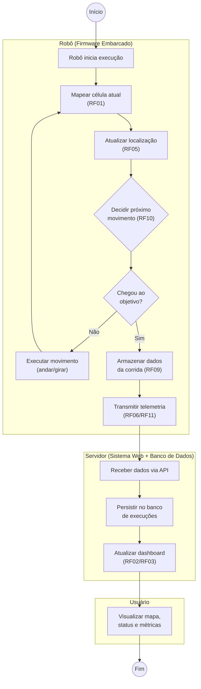

# Projeto Conceitual de Software

- [Explicações adicionais](https://drive.google.com/file/d/1WWIz6609c7Y7zAQRBWHSbX0t2vEJ2z1A/view?usp=sharing)
- [Noções de UML](https://drive.google.com/file/d/1l1yt2ittHuRKIXVXYT76P1HriR07pK-t/view?usp=sharing)
- [Requisitos](https://engsoftmoderna.info/cap3.html)

## Diagrama de Atividades

O diagrama abaixo descreve o fluxo de comportamento funcional do MicroMouse durante uma corrida,
desde o início da execução até a chegada ao objetivo, evidenciando os três atores envolvidos
(raias/*swimlanes*): o **Robô** (firmware embarcado), o **Servidor** (sistema web de telemetria +
banco de dados) e o **Usuário** (quem acompanha a corrida pelo dashboard).

**Leitura do fluxo:**
- **Entradas:** leituras dos sensores de parede/distância (fornecidas pela Eletrônica) a cada
  célula percorrida.
- **Atividades do Robô:** mapeamento incremental do labirinto, atualização de posição, decisão de
  navegação (algoritmo de busca) e execução do movimento — laço que se repete até o objetivo ser
  alcançado.
- **Ponto de decisão:** "Chegou ao objetivo?" separa o laço de navegação (RF10) do encerramento da
  corrida.
- **Saídas:** dados de execução armazenados localmente (RF09) e depois transmitidos (RF06/RF11)
  para o Servidor, que persiste no banco e atualiza o dashboard em tempo real (RF02/RF03) —
  visualizado pelo Usuário.
- **Sincronização:** a transição Robô → Servidor é o ponto de sincronização entre as raias
  (transmissão de telemetria via API).

> **Itens fundamentais:**
> - **Diagrama Atividades UML:** descrever e explicar o fluxo do comportamento funcional do produto proposto, evidenciando, de forma clara e estruturada, como as atividades são executadas, em que ordem e sob quais condições. Esse diagrama permite compreender o funcionamento dinâmico do sistema, destacando:
>   - os principais atores (usuários ou sistemas externos) envolvidos no processo;
>   - as atividades de negócio realizadas por cada ator ou pelo próprio sistema;
>   - os insumos (entradas) necessários para a execução das atividades;
>   - os resultados (saídas) gerados ao longo do fluxo;
>   - os pontos de decisão, paralelismo e sincronização das atividades;
>   - Entre as notações mais relevantes, destacam-se o estado inicial e final, atividades, nós de decisão e junção, barras de bifurcação, Raias (*swimlanes*) e Fluxos de controle.
> - **_Backlog_ do Produto**
>   - Detalhar os requisitos funcionais (RF) com a técnica de documentação e especificação de história de usuário (HU);
>   - Protótipos de interface gráfica do *software* em alta fidelidade.
>     - **Todas HUs devem conter sua descrição (Eu-Como-Para), critérios de aceitação e protótipos de interface, documentadas no github.**
>   - Exporte as informações do Backlog do Produto no GitHub Projects [em formato CSV](https://docs.github.com/en/issues/planning-and-tracking-with-projects/managing-your-project/exporting-your-projects-data), e [renderize em Markdown](https://www.google.com/search?q=convert+CSV+file+to+Markdown+table) no formato a seguir:

### Requisitos Funcionais

<u>RF-00/Épico-00: Título do RF/Épico</u>

| ID (Link Github Projects) | Título | Prioridade |
|:------| :-- | :--- |
| HU-00 | | |
| HU-01 | | |
| HU-02 | | |

<u>RF-01/Épico-01: Título do RF/Épico</u>

| ID (Link Github Projects) | Título | Prioridade |
|:--------------------------| :-- | :--- |
| HU-03                     | | |
| HU-04                     | | |
| HU-05                     | | |

### Requisitos Não-Funcionais

| ID (Link Github Projects) | Título | Prioridade | Rastreabilidade |
|:--------------------------| :-- | :--- |:----------------|
| RNF-01                    | | | RF-00/HU-00     |
| RNF-02                    | | |                 |
| RNF-03                    | | |                 |

> 
> - **Descrição da arquitetura da solução de _software_ proposta:**
>   - Esta subseção deve contemplar o documento de arquitetura do sistema e deve ser estruturado segundo as visões (4+1) previstas no processo unificado (UP): lógica, de processos; implementação, implantação e dados (substituirá a visão de casos de uso).
>   - Propósito do *software* (qual o seu papel no sistema);
>   - Padrão adotado: MVC, MVP, Microsserviços, Monolítico, etc (Justificar);
>   - Linguagens de programação: Java, Python, C#, JavaScript, etc.
>   - *Frameworks* e bibliotecas: Spring Boot, .NET Core, React, Angular, Django, etc.
>   - Banco de dados: Relacional (PostgreSQL, MySQL, etc) X NãoSQL (MongoDB, etc).
>   - Persistência de dados: Modelo Entidade-Relacionamento (MER) e seu respectivo Diagrama Entidade-Relacionamento (DER), aplicáveis quando a solução utiliza banco de dados relacional; alternativamente, diagrama de estrutura de documentos, empregado nos casos em que a arquitetura adota banco de dados não relacional.
> - **Roteiro de testes funcionais:**
>   - Código do caso de teste;
>   - Nome do caso de teste;
>   - Rastreabilidade: Link do(a) RF/HU associado(a);
>   - Objetivo do caso de teste;
>   - Pré-condições do sistema para o teste ser realizado, quando se aplicar;
>   - Descrição dos procedimentos a serem executados para o teste;
>   - Resultado esperado para o teste ser aprovado (pós-condição após realizado o teste);