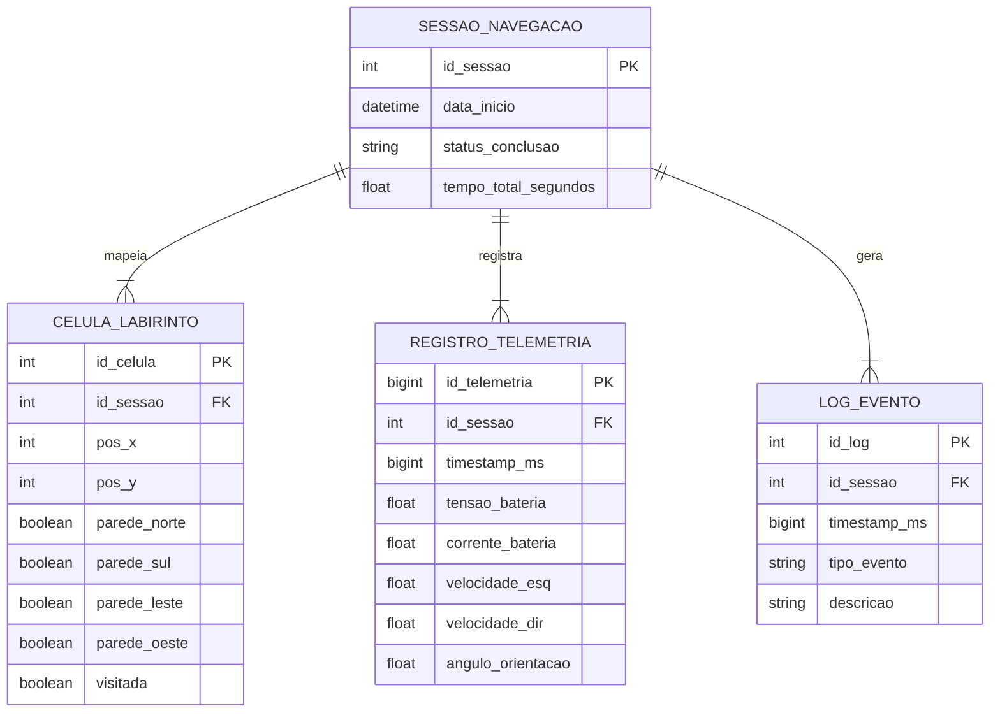

# Projeto Conceitual de Software

- [Explicações adicionais](https://drive.google.com/file/d/1WWIz6609c7Y7zAQRBWHSbX0t2vEJ2z1A/view?usp=sharing)
- [Noções de UML](https://drive.google.com/file/d/1l1yt2ittHuRKIXVXYT76P1HriR07pK-t/view?usp=sharing)
- [Requisitos](https://engsoftmoderna.info/cap3.html)

## Diagrama de Atividades

O diagrama abaixo descreve o fluxo de comportamento funcional do MicroMouse durante uma corrida,
desde o início da execução até a chegada ao objetivo, evidenciando os três atores envolvidos
(raias/_swimlanes_): o **Robô** (firmware embarcado), o **Servidor** (sistema web de telemetria +
banco de dados) e o **Usuário** (que acompanha a corrida pelo dashboard).

## Diagrama de Atividades no Figma

<iframe style="border: 1px solid rgba(0, 0, 0, 0.1);" width="800" height="450" src="https://embed.figma.com/board/TayFIuY1BoFhklOIzuSOSx/PI1---Diagrama-de-Atividades?node-id=2-8&embed-host=share" allowfullscreen></iframe>

**Leitura do fluxo:**

- **Entradas:** Leituras dos sensores de distância a cada célula percorrida e calibração inicial do sistema.
- **Atividades do Robô:** Inicialização do sistema, mapeamento e atualização da localização do robô, decisão do próximo movimento e execução da navegação.
- **Ponto de decisão:** "Atingiu a saída?" separa o ciclo de navegação e tomada de decisão da etapa de encerramento da corrida.
- **Sincronização e Paralelismo:** A cada movimento executado, o robô dispara em segundo plano a transmissão de dados de telemetria para a Plataforma Web, mantendo o laço de navegação ativo de forma paralela.
- **Atividades da Plataforma Web:** Recebimento dos pacotes de telemetria, salvamento dos dados no banco de dados e atualização da interface do dashboard em tempo real.
- **Atividades do Usuário:** Acompanhamento da corrida ao vivo no dashboard e análise do relatório final de desempenho ao término do percurso.
- **Saídas:** Dados da corrida armazenados localmente no MicroMouse, histórico completo persistido no banco de dados e relatório exibido no dashboard web.

> **Itens fundamentais:**
>
> - **Diagrama Atividades UML:** descrever e explicar o fluxo do comportamento funcional do produto proposto, evidenciando, de forma clara e estruturada, como as atividades são executadas, em que ordem e sob quais condições. Esse diagrama permite compreender o funcionamento dinâmico do sistema, destacando:
>   - os principais atores (usuários ou sistemas externos) envolvidos no processo;
>   - as atividades de negócio realizadas por cada ator ou pelo próprio sistema;
>   - os insumos (entradas) necessários para a execução das atividades;
>   - os resultados (saídas) gerados ao longo do fluxo;
>   - os pontos de decisão, paralelismo e sincronização das atividades;
>   - Entre as notações mais relevantes, destacam-se o estado inicial e final, atividades, nós de decisão e junção, barras de bifurcação, Raias (_swimlanes_) e Fluxos de controle.
> - **_Backlog_ do Produto**
>   - Detalhar os requisitos funcionais (RF) com a técnica de documentação e especificação de história de usuário (HU);
>   - Protótipos de interface gráfica do _software_ em alta fidelidade.
>     - **Todas HUs devem conter sua descrição (Eu-Como-Para), critérios de aceitação e protótipos de interface, documentadas no github.**
>   - Exporte as informações do Backlog do Produto no GitHub Projects [em formato CSV](https://docs.github.com/en/issues/planning-and-tracking-with-projects/managing-your-project/exporting-your-projects-data), e [renderize em Markdown](https://www.google.com/search?q=convert+CSV+file+to+Markdown+table) no formato a seguir:

### Requisitos Funcionais
### RF01/Épico-01: Mapear Labirinto

| ID (Link Github Projects) | Título | Prioridade |
|:------|:--|:--|
| HU-00 | Construção contínua do mapa interno do labirinto | Must |

#### HU-00 — Construção contínua do mapa interno do labirinto

**Eu, como** Operador da Equipe,
**gostaria que** o MicroMouse construa e atualize continuamente um mapa interno do labirinto à medida que se desloca,
**para que** ele identifique caminhos livres, paredes e becos sem saída de forma autônoma, permitindo a navegação sem intervenção humana.

**Critérios de aceitação:**
- Para cada célula visitada, o robô registra quais das 4 paredes foram identificadas (com base no RF04).
- O mapa interno é atualizado célula a célula, em tempo real, sem necessidade de reiniciar a exploração.
- Ao final do trajeto (com sucesso ou não), o mapa interno reflete corretamente a estrutura de paredes percebida pelos sensores até aquele ponto.
- O mapa interno pode ser recuperado/consultado pelo sistema para ser transmitido e exibido no sistema web (RF02/RF06).

**Protótipo de interface:** Não se aplica. É processamento interno embarcado no MicroMouse, sem tela própria — o resultado (o mapa) é exibido pela interface descrita em RF02.

---

### RF02/Épico-02: Exibir dados do Labirinto

| ID (Link Github Projects) | Título | Prioridade |
|:------|:--|:--|
| HU-01 | Visualização do mapa do labirinto em tempo real | Should |
| HU-02 | Consulta histórica do mapa por labirinto ou por todos | Should |

#### HU-01 — Visualização do mapa do labirinto em tempo real

**Eu, como** Operador da Equipe,
**gostaria de** visualizar, em tempo real no sistema web, o mapa do labirinto sendo construído pelo MicroMouse durante a corrida,
**para que** eu acompanhe visualmente o progresso da navegação e identifique rapidamente se o robô está com dificuldades.

**Critérios de aceitação:**
- A tela exibe uma grade correspondente ao tipo de labirinto em disputa (4x4, 8x4 ou 12x4 células).
- Paredes detectadas pelo robô aparecem no mapa conforme são identificadas, com latência máxima aceitável definida pela equipe (ex.: até 2 segundos).
- A célula de início (canto de partida) e a célula de objetivo (canto diametralmente oposto) são destacadas visualmente e de forma diferenciada.
- O trajeto já percorrido pelo robô é sobreposto ao mapa.
- A tela indica claramente quando não há dados/conexão disponível (robô ainda não iniciou ou comunicação perdida).

**Protótipo de interface (descrição textual):**
 [Tela]() **"Mapa do Labirinto"**, componente central do sistema web. Cabeçalho com o tipo de labirinto ativo (ex.: "Labirinto 8x4") e um indicador de status "🟢 Ao vivo" / "🔴 Sem conexão". Corpo principal com a grade do labirinto renderizada dinamicamente célula a célula (linhas grossas simulando paredes brancas com topo vermelho, como no labirinto físico; piso escuro). A célula inicial é destacada em verde-claro e a célula de objetivo em rosa/vermelho-claro, reproduzindo as cores usadas nos slides do contrato. O trajeto percorrido é desenhado como uma linha pontilhada ou sequência de pontos sobre as células já visitadas. Uma legenda lateral explica as cores e símbolos usados. 

#### HU-02 — Consulta histórica do mapa por labirinto ou por todos

**Eu, como** Integrante da Equipe (Analista),
**gostaria de** consultar, após a conclusão de uma corrida, os dados estruturais e o mapa final de um labirinto específico ou de todos os labirintos já percorridos,
**para que** eu possa analisar o desempenho de navegação do robô em execuções passadas.

**Critérios de aceitação:**
- A tela lista as execuções/labirintos já persistidos no banco de dados (RNF01).
- É possível filtrar/selecionar um labirinto específico (4x4, 8x4 ou 12x4) ou optar por visualizar todos.
- O mapa final exibido corresponde exatamente aos dados persistidos ao final daquela execução.
- Caso não existam execuções registradas, a tela informa isso de forma clara (estado vazio).

**Protótipo de interface (descrição textual):**
[Tela]() **"Histórico de Labirintos"**. No topo, um seletor (abas ou dropdown) com as opções "Todos / 4x4 / 8x4 / 12x4". Abaixo, uma lista/tabela de execuções, cada linha com data/hora, tipo de labirinto e resultado resumido (concluído/não concluído). Ao clicar em uma execução, abre o mapa final daquela corrida reutilizando o mesmo componente visual de grade da HU-01, porém em modo estático (sem indicador "ao vivo").

---

### RF03/Épico-03: Exibir dados do MicroMouse

| ID (Link Github Projects) | Título | Prioridade |
|:------|:--|:--|
| HU-03 | Painel de status do MicroMouse em tempo real | Should |
| HU-04 | Consulta histórica de desempenho do MicroMouse | Should |

#### HU-03 — Painel de status do MicroMouse em tempo real

**Eu, como** Operador da Equipe,
**gostaria de** visualizar, em tempo real no sistema web, os dados de status do MicroMouse (posição atual, velocidade, nível de bateria e tempo decorrido) durante a corrida,
**para que** eu acompanhe o comportamento do robô e identifique rapidamente eventuais falhas ou mau funcionamento.

**Critérios de aceitação:**
- O painel atualiza os valores em um intervalo curto e definido pela equipe (ex.: a cada 500 ms – 1 s).
- São exibidos, no mínimo: posição atual (linha/coluna), velocidade instantânea e/ou média, percentual de bateria restante e tempo decorrido desde o início da corrida.
- Há indicação visual clara (ex.: alerta) em caso de perda de comunicação com o robô (RF06).
- Há indicação visual quando a bateria atinge níveis considerados críticos.

**Protótipo de interface (descrição textual):**
[Painel]() **"Status do MicroMouse"**, em formato de dashboard com cartões (cards): (1) indicador circular/barra de bateria (%), com cor mudando de verde → amarelo → vermelho conforme o nível cai; (2) velocímetro ou barra de velocidade atual; (3) cronômetro digital com o tempo decorrido; (4) indicador textual da posição atual (ex.: "C3"); (5) badge de status de conexão ("Conectado" / "Sem sinal"). O painel fica normalmente posicionado ao lado do mapa (HU-01), formando a tela principal de acompanhamento da corrida.

#### HU-04 — Consulta histórica de desempenho do MicroMouse

**Eu, como** Integrante da Equipe (Analista),
**gostaria de** consultar o histórico de desempenho do MicroMouse (velocidade média, tempo de conclusão, consumo de bateria e se o desafio foi cumprido) de execuções passadas, filtrando por labirinto específico ou por todos,
**para que** eu possa analisar a evolução do robô entre tentativas e embasar ajustes técnicos.

**Critérios de aceitação:**
- A listagem exibe, por execução: tipo de labirinto, tempo de conclusão, velocidade média, consumo de bateria e status "Desafio Cumprido" (Sim/Não).
- É possível filtrar por labirinto específico (4x4, 8x4, 12x4) ou visualizar todos.
- Os dados exibidos correspondem exatamente aos dados persistidos no banco de dados (RNF01).

**Protótipo de interface (descrição textual):**
[Tela]() **"Histórico do MicroMouse"**, com o mesmo filtro superior da HU-02 ("Todos / 4x4 / 8x4 / 12x4"). Corpo principal em formato de tabela, com colunas: Data, Labirinto, Tempo de Conclusão, Velocidade Média, Bateria Consumida e Desafio Cumprido (ícone ✔/✘). Pode compartilhar a mesma tela de HU-02 (uma única tela "Histórico", com abas "Labirinto" e "MicroMouse") — decisão de composição de tela a ser validada na etapa de design.

---

### RF04/Épico-04: Identificar Paredes

| ID (Link Github Projects) | Título | Prioridade |
|:------|:--|:--|
| HU-05 | Detecção de paredes adjacentes por sensores | Must |

#### HU-05 — Detecção de paredes adjacentes por sensores

**Eu, como** Operador da Equipe,
**gostaria que** o MicroMouse detecte, por meio de seus sensores, a presença e a proximidade de paredes adjacentes (frontal, lateral esquerda e lateral direita) em cada célula,
**para que** ele tome decisões seguras de navegação e evite colisões com a estrutura do labirinto.

> Nota: comportamento autônomo do robô.

**Critérios de aceitação:**
- Os sensores identificam corretamente presença/ausência de parede em cada uma das direções adjacentes, considerando a dimensão da célula (18 cm de lado, incluindo espessura das paredes).
- A detecção ocorre antes de o robô decidir seu próximo movimento (giro ou avanço).
- A taxa de falsos positivos/negativos não impede a conclusão do trajeto dentro do limite de 3 tentativas por labirinto.

**Protótipo de interface:** Não se aplica. É funcionalidade de sensoriamento embarcado, sem interface própria — seu resultado é refletido no mapa exibido em RF02.

---

### RF05/Épico-05: Monitorar Localização

| ID (Link Github Projects) | Título | Prioridade |
|:------|:--|:--|
| HU-06 | Rastreamento da posição do robô na grade | Must |

#### HU-06 — Rastreamento da posição do robô na grade

**Eu, como** Operador da Equipe,
**gostaria que** o MicroMouse acompanhe e atualize sua posição exata (linha/coluna) dentro da grade do labirinto a cada movimento realizado,
**para que** o algoritmo de navegação (RF10) e os dados exibidos em tempo real (RF03) estejam sempre corretos.

> Nota: comportamento autônomo do robô.

**Critérios de aceitação:**
- Após cada movimento (avanço ou giro), a posição interna do robô é recalculada corretamente.
- A posição atual pode ser consultada e transmitida para exibição em tempo real (RF06/RF03).
- O robô nunca perde a referência da célula em que está durante uma tentativa válida (sem colisão/malfuncionamento).

**Protótipo de interface:** Não se aplica. É processamento interno embarcado, sem tela própria.

---

### RF06/Épico-06: Transmitir dados

| ID (Link Github Projects) | Título | Prioridade |
|:------|:--|:--|
| HU-07 | Envio contínuo de dados do robô para a central de controle | Should |

#### HU-07 — Envio contínuo de dados do robô para a central de controle

**Eu, como** Operador da Equipe,
**gostaria que** o MicroMouse envie continuamente, durante a corrida, os dados coletados pelos sensores e pelo sistema de bordo para a central de controle (sistema web),
**para que** eu consiga acompanhar a corrida em tempo real pelas telas de RF02 e RF03.

**Critérios de aceitação:**
- A comunicação entre o robô e o sistema web é estabelecida antes do início da corrida (handshake/conexão).
- Os dados são enviados em um intervalo regular e definido pela equipe.
- O sistema web sinaliza claramente perda de conexão/timeout de comunicação (consumido pela HU-03).
- Em caso de falha temporária de transmissão, os dados continuam sendo armazenados localmente (RF09) até a reconexão.

**Protótipo de interface:** Não se aplica. É requisito de infraestrutura de comunicação (protocolo/canal robô ↔ sistema web); seu efeito é percebido indiretamente nas telas de RF02 e RF03.

---

### RF07/Épico-07: Fazer giro completo

| ID (Link Github Projects) | Título | Prioridade |
|:------|:--|:--|
| HU-08 | Execução de giro de 180° para retorno | Must |

#### HU-08 — Execução de giro de 180° para retorno

**Eu, como** Operador da Equipe,
**gostaria que** o MicroMouse execute um giro controlado de 180° em torno do próprio eixo ao identificar um beco sem saída ou necessidade de retorno,
**para que** ele continue a exploração do labirinto sem ficar preso, sem intervenção humana.

> Nota: comportamento autônomo do robô.

**Critérios de aceitação:**
- Ao concluir o giro, a orientação do robô é invertida corretamente (180°), sem deslocamento para outra célula.
- O movimento não provoca colisão com paredes, respeitando o controle de velocidade/frenagem exigido em RNF05.
- O giro é acionado apenas quando necessário pela lógica de navegação (RF10), evitando giros desnecessários.

**Protótipo de interface:** Não se aplica.

---

### RF08/Épico-08: Andar para frente

| ID (Link Github Projects) | Título | Prioridade |
|:------|:--|:--|
| HU-09 | Deslocamento linear entre células adjacentes | Must |

#### HU-09 — Deslocamento linear entre células adjacentes

**Eu, como** Operador da Equipe,
**gostaria que** o MicroMouse se desloque linearmente da célula atual para a célula adjacente à frente, de forma precisa e sem colisões,
**para que** ele avance pelo labirinto em direção ao objetivo.

> Nota: comportamento autônomo do robô.

**Critérios de aceitação:**
- O deslocamento cobre exatamente a distância de uma célula (18 cm), respeitando a dimensão mecânica compatível (RNF04).
- A velocidade e a frenagem aplicadas respeitam o RNF05 (sem causar dano à estrutura do labirinto ou ao robô).
- O robô finaliza o movimento corretamente alinhado na célula seguinte, pronto para a próxima decisão de navegação.

**Protótipo de interface:** Não se aplica.

---

### RF09/Épico-09: Armazenar dados

| ID (Link Github Projects) | Título | Prioridade |
|:------|:--|:--|
| HU-10 | Registro local de dados operacionais a bordo | Should |

#### HU-10 — Registro local de dados operacionais a bordo

**Eu, como** Operador da Equipe,
**gostaria que** o MicroMouse registre e salve localmente (a bordo) as informações operacionais coletadas durante a navegação,
**para que** esses dados não se percam em caso de falha de comunicação e possam ser posteriormente sincronizados com a central de controle.

**Critérios de aceitação:**
- Os dados operacionais (posição, sensores, métricas) são gravados em memória não volátil a bordo durante toda a execução.
- Em caso de queda de comunicação com o sistema web, o registro local continua ocorrendo normalmente.
- Os dados armazenados localmente podem ser recuperados e reenviados/sincronizados após o reestabelecimento da comunicação.

**Protótipo de interface:** Não se aplica. É armazenamento embarcado, sem interface própria — distinto da persistência central em banco de dados (RNF01), que é responsabilidade do sistema web.

---

### RF10/Épico-10: Navegar labirinto

| ID (Link Github Projects) | Título | Prioridade |
|:------|:--|:--|
| HU-11 | Resolução autônoma do labirinto até o objetivo | Must |

#### HU-11 — Resolução autônoma do labirinto até o objetivo

**Eu, como** Operador da Equipe,
**gostaria que** o MicroMouse execute autonomamente algoritmos de busca e tomada de decisão para percorrer o labirinto, desde o ponto de partida até a área de objetivo, sem intervenção humana,
**para que** a equipe cumpra o desafio da competição dentro das regras do contrato.

> Nota: Este é o épico mais amplo, que orquestra RF04, RF05, RF07, RF08 e RF01.

**Critérios de aceitação:**
- O robô inicia sempre no beco sem saída do canto de partida e para ao alcançar a célula de objetivo (canto diametralmente oposto).
- Nenhuma intervenção humana ocorre durante a resolução, exceto em caso de malfuncionamento ou colisão (conforme permitido pelo contrato).
- O robô detecta corretamente quando alcançou a área de objetivo e encerra a tentativa.
- O algoritmo é capaz de resolver os três tipos de labirinto da competição (4x4, 8x4 e 12x4) dentro do limite de até 3 tentativas e 10 minutos por desafio.
- O código e a memória sobre o labirinto não são alterados manualmente durante a resolução do trajeto (regra do contrato).

**Protótipo de interface:** Não se aplica.

---

### RF11/Épico-11: Realizar telemetria

| ID (Link Github Projects) | Título | Prioridade |
|:------|:--|:--|
| HU-12 | Coleta e transmissão contínua de métricas de operação | Should |

#### HU-12 — Coleta e transmissão contínua de métricas de operação

**Eu, como** Operador da Equipe,
**gostaria que** o MicroMouse colete e transmita continuamente métricas de operação (velocidade, tempo decorrido, consumo de bateria e status do desafio) para a central de controle,
**para que** seja possível o acompanhamento contínuo do desempenho do robô durante a corrida.

**Critérios de aceitação:**
- As métricas coletadas incluem, no mínimo: velocidade instantânea/média, tempo decorrido, percentual de bateria consumida e status da tentativa (em andamento / concluída / falha).
- As métricas são transmitidas junto com os demais dados de RF06, em intervalo regular definido pela equipe.
- As métricas coletadas ficam disponíveis para exibição em tempo real nas telas de RF03 (HU-03) e, após a corrida, no histórico (HU-04).

**Protótipo de interface:** Não se aplica. É o mecanismo de coleta/transmissão de métricas; a visualização propriamente dita ocorre via RF03.

---

## 2. Requisitos Não-Funcionais

| ID (Link Github Projects) | Título | Prioridade | Rastreabilidade |
|:------|:--|:--|:--|
| RNF-01 | Persistência de Dados Operacionais | Should | RF09/HU-10; RF02/HU-02; RF03/HU-04 |
| RNF-02 | Autonomia da Bateria (3 trajetos / 30 min) | Must | RF10/HU-11; RF03/HU-03 |
| RNF-03 | Fonte de Energia Recarregável | Should | RF10/HU-11 (enabler geral, sem tela própria) |
| RNF-04 | Compatibilidade de Dimensão Mecânica (célula 18 cm) | Must | RF08/HU-09; RF07/HU-08 |
| RNF-05 | Tolerância a Colisão e Controle de Impacto | Must | RF07/HU-08; RF08/HU-09 |
| RNF-06 | Integridade Estrutural | Must | RF07/HU-08; RF08/HU-09; RF10/HU-11 |

# Arquitetura de Software: Solução MicroMouse

Este documento apresenta a especificação arquitetural do sistema embarcado e da central de monitoramento para o robô **MicroMouse**, estruturado de acordo com o modelo de **Visões Arquiteturais (4+1)** do Processo Unificado (UP). Em conformidade com as diretrizes do projeto, a tradicional _Visão de Casos de Uso_ foi substituída pela **Visão de Dados**.

---

## 1. Visão Geral e Propósito do Software

### 1.1 Propósito do Software

O software possui o papel de atuar como o **sistema de controle autônomo e telemetria de bordo** do robô MicroMouse. Ele é responsável por:

- Processar sinais de sensores em tempo real para identificação de paredes, localização e orientação.

- Executar algoritmos de navegação e mapeamento dinâmico do labirinto.

- Controlar os atuadores (motores via controle PID e odometria) para movimentação precisa.

- Persistir e transmitir dados de telemetria, logs de execução e a topologia do labirinto para uma central de controle via Wi-Fi em tempo real.

---

## 2. Visão Lógica

A Visão Lógica descreve a organização conceitual e a estruturação das classes e módulos do sistema.

### 2.1 Padrões Arquiteturais Adotados e Justificativa

- Firmware Embarcado (Robô): Arquitetura em Camadas (Layered Architecture) orientada a Eventos/Tarefas.
  - **Justificativa:** O software de bordo lida diretamente com o hardware do microcontrolador ESP32. A divisão em camadas garante o desacoplamento entre os drivers de baixo nível (I2C, PWM, GPIO), a lógica de controle PID/Navegação e a camada de comunicação de alto nível.

- Dashboard (Central de Controle): Padrão MVC (Model-View-Controller).
  - **Justificativa:** Permite a separação entre a interface visual que renderiza o labirinto e métricas do robô (**View**), os serviços que processam as mensagens WebSockets recebidas (**Controller**) e os modelos de dados da sessão e estado (**Model**).

### 2.2 Divisão em Módulos do Sistema

1. Módulo HAL / Drivers de Hardware (Baixo Nível):
   - _Driver IMU (MPU6500):_ Leitura do giroscópio e acelerômetro via I2C para estimativa de orientação.

   - _Driver Ultrassônico (US-100):_ Leitura contínua da distância de paredes via UART/GPIO.

   - _Driver Ponte H (DRV8833):_ Controle PWM para acionamento dos motores N20.

   - _Driver de Odometria (Encoders N20):_ Contagem de pulsos por interrupção para cálculo de deslocamento.

   - _Driver de Potência (INA226):_ Monitoramento de tensão e corrente da bateria via I2C.

2. Módulo de Controle e Navegação (Médio Nível):
   - _Malha de Controle PID:_ Mantém o robô centralizado e estabilizado durante a locomoção.

   - _Mapeador e Buscador (Floodfill):_ Atualiza a matriz do labirinto e calcula as ações de rotação e avanço.

3. Módulo de Comunicação e Armazenamento (Alto Nível):
   - _Gerenciador NVS/Flash:_ Armazena configurações e histórico de logs localmente.

   - _Servidor WebSockets/Wi-Fi:_ Transmite a telemetria do robô e atualizações do mapa.

---

## 3. Visão de Processos

A Visão de Processos trata da concorrência, tempo real e distribuição do processamento entre as tarefas do sistema.

O microcontrolador **ESP32** conta com dois núcleos de processamento (Core 0 e Core 1) e executa o sistema operacional de tempo real **FreeRTOS**. As tarefas (_Tasks_) são distribuídas entre os núcleos para garantir resposta imediata aos sensores sem bloquear as rotinas de comunicação:

- **Processo 1: `Task_Sensors` (Periódico - 10ms | Prioridade Alta):**
  - Executa a amostragem do giroscópio MPU6500 e a leitura dos 4 sensores US-100 para identificação imediata de obstáculos/paredes.

- **Processo 2: `Task_PID_Control` (Periódico - 5ms | Prioridade Máxima):**
  - Processa interrupções dos leitores de encoder dos motores N20, calcula os erros de trajetória e atualiza o ciclo de trabalho PWM da ponte H DRV8833.

- **Processo 3: `Task_Navigation` (Baseado em Eventos | Prioridade Média):**
  - Disparada quando o robô alcança o centro de uma célula. Executa a lógica de atualização da grade de navegação e decide a próxima direção.

- **Processo 4: `Task_Comm` (Assíncrono | Prioridade Baixa):**
  - Formata os dados no formato JSON e envia pacotes de telemetria e o estado do labirinto para a central de controle via WebSockets.

---

## 4. Visão de Implementação

A Visão de Implementação especifica as tecnologias, linguagens, frameworks e bibliotecas escolhidas para a solução.

### 4.1 Tecnologias Adotadas

| Camada                            | Tecnologia / Linguagem      | Frameworks e Bibliotecas                                                             | Justificativa                                                                                                                            |
| --------------------------------- | --------------------------- | ------------------------------------------------------------------------------------ | ---------------------------------------------------------------------------------------------------------------------------------------- |
| **Firmware (Embarcado)**          | **C++ / C**              | FreeRTOS, Arduino ESP32 Core, `Wire.h` (I2C), `ESPAsyncWebServer`, `ArduinoJson`  | Permite controle rigoroso de baixo nível, acesso direto aos registradores e periféricos da ESP32 com altíssimo desempenho de tempo real. |
| **Dashbord (Backend/Server)**     | **TypeScript / Node.js**    | Express.js, `ws` (WebSockets), TypeORM / Prisma                                      | Plataforma leve e eficiente em I/O assíncrono para manipulação da transmissão contínua de dados de telemetria.                           |
| **Dashbord (Frontend/Dashboard)** | **TypeScript / JavaScript** | React.js, TailwindCSS, Chart.js, HTML5 Canvas API                                    | Permite renderização fluida da grade do labirinto em tempo real e atualização gráfica das métricas do robô.                              |

---

## 5. Visão de Implantação

A Visão de Implantação descreve a arquitetura física e a topologia de hardware da solução.

### Componentes de Hardware Utilizados e Conexões:

1. **ESP32 DevKit 30 Pinos:** Unidade Central de Processamento.

2. **Ponte H DRV8833:** Conectada às saídas PWM da ESP32 para controle bidirecional dos Motores N20-6V.

3. **2x Motores N20 com Encoders:** Conectados a pino de interrupção da ESP32 para feedback de malha fechada.

4. **4x Sensores Ultrassônicos US-100:** Dispostos nas posições frontal, traseira, esquerda e direita para mapeamento de paredes.

5. **IMU MPU6500:** Conectado via barramento I2C para estimativa de ângulo e giros precisos de 180°.

6. **Sensor INA226:** Conectado via I2C para leitura de corrente e tensão da bateria.

7. **Regulador Buck MP1584:** Regula a tensão de alimentação dos módulos lógicos.

---

## 6. Visão de Dados

A Visão de Dados descreve a modelagem e a estrutura de persistência das informações manipuladas e gravadas pelo sistema.

### 6.1 Escolha da Tecnologia de Banco de Dados: **Relacional (SQLite / PostgreSQL)**

- **Justificativa:** Os dados manipulados pelo sistema possuem um alto grau de estruturação e esquemas rígidos (ex: coordenadas $X,Y$ fixas em uma matriz, leituras periódicas de telemetria vinculadas a uma sessão de execução e registros tabulares de erros).

- No **Dashbord**, adota-se um **Banco de Dados Relacional** (SQLite para execução local simples ou PostgreSQL para diagnósticos avançados).

- No **Robô (ESP32)**, utiliza-se a memória Flash interna (via biblioteca `Preferences` ou sistema de arquivos `LittleFS`) configurada estruturalmente em formato relacional/tabelar binário para armazenamento offline caso ocorra perda do link Wi-Fi.

---

### 6.2 Modelo Entidade-Relacionamento (MER)

#### Entidades e Atributos:

1. **SESSAO_NAVEGACAO:**

- `id_sessao` (PK, Inteiro): Identificador único do percurso.

- `data_inicio` (DateTime): Registro do momento do início da corrida.

- `status_conclusao` (Texto): Status do percurso (Em andamento, Concluído, Interrompido por Falha).

- `tempo_total_segundos` (Float): Tempo transcorrido até o reconhecimento da linha de chegada.

2. **CELULA_LABIRINTO:**

- `id_celula` (PK, Inteiro): Identificador da célula.

- `id_sessao` (FK, Inteiro): Referência à sessão atual.

- `pos_x` (Inteiro): Coordenada $X$ da célula na grade do labirinto.

- `pos_y` (Inteiro): Coordenada $Y$ da célula na grade do labirinto.

- `parede_norte` (Booleano): Presença de parede ao Norte.

- `parede_sul` (Booleano): Presença de parede ao Sul.

- `parede_leste` (Booleano): Presença de parede ao Leste.

- `parede_oeste` (Booleano): Presença de parede ao Oeste.

- `visitada` (Booleano): Flag indicando se o robô passou pela célula.

3. **REGISTRO_TELEMETRIA:**

- `id_telemetria` (PK, BigInt): Identificador único da amostra.

- `id_sessao` (FK, Inteiro): Sessão associada.

- `timestamp_ms` (BigInt): Milissegundos transcorridos desde o boot.

- `tensao_bateria` (Float): Leitura do sensor INA226 em Volts.

- `corrente_bateria` (Float): Leitura do sensor INA226 em Amperes.

- `velocidade_esq` (Float): Velocidade calculada do motor esquerdo em mm/s.

- `velocidade_dir` (Float): Velocidade calculada do motor direito em mm/s.

- `angulo_orientacao` (Float): Leitura de orientação Yaw da IMU MPU6500.

4. **LOG_EVENTO:**

- `id_log` (PK, Inteiro): Identificador do registro.

- `id_sessao` (FK, Inteiro): Sessão associada.

- `timestamp_ms` (BigInt): Horário do evento.

- `tipo_evento` (Texto): Categoria (INFO, WARN, ERROR, SUCCESS).

- `descricao` (Texto): Detalhamento do evento (ex: "Linha de Chegada Reconhecida", "Motores Interrompidos").

#### Relacionamentos e Cardinalidades:

- Uma **SESSAO_NAVEGACAO** possui $1:N$ **CELULA_LABIRINTO** (Uma sessão gera o mapeamento de várias células do labirinto).

- Uma **SESSAO_NAVEGACAO** possui $1:N$ **REGISTRO_TELEMETRIA** (Uma sessão coleta continuadamente múltiplos pacotes de telemetria).

- Uma **SESSAO_NAVEGACAO** possui $1:N$ **LOG_EVENTO** (Uma sessão registra diversos logs operacionais).

---

### 6.3 Diagrama Entidade-Relacionamento (DER)

---

> - **Roteiro de testes funcionais:**
>   - Código do caso de teste;
>   - Nome do caso de teste;
>   - Rastreabilidade: Link do(a) RF/HU associado(a);
>   - Objetivo do caso de teste;
>   - Pré-condições do sistema para o teste ser realizado, quando se aplicar;
>   - Descrição dos procedimentos a serem executados para o teste;
>   - Resultado esperado para o teste ser aprovado (pós-condição após realizado o teste);
