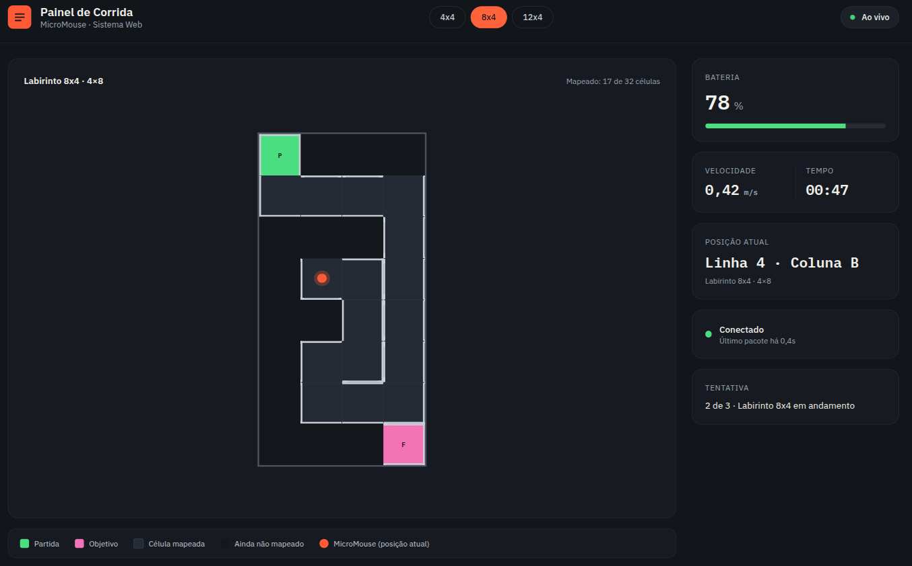
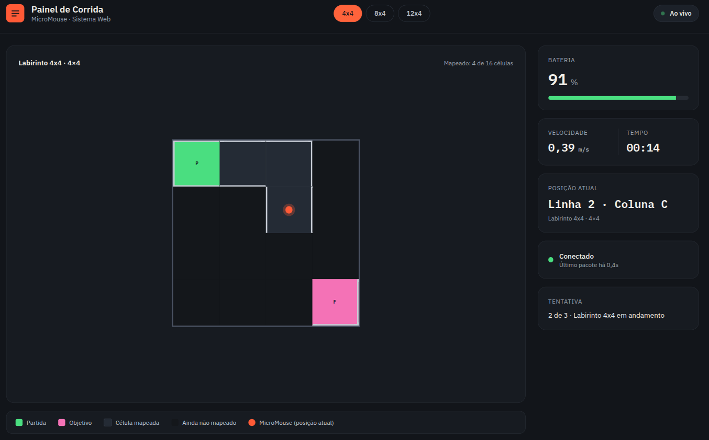
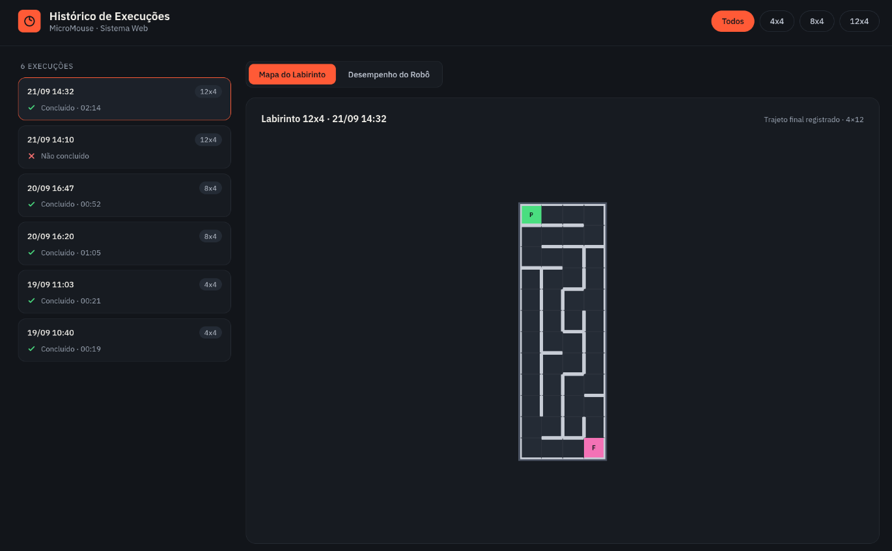
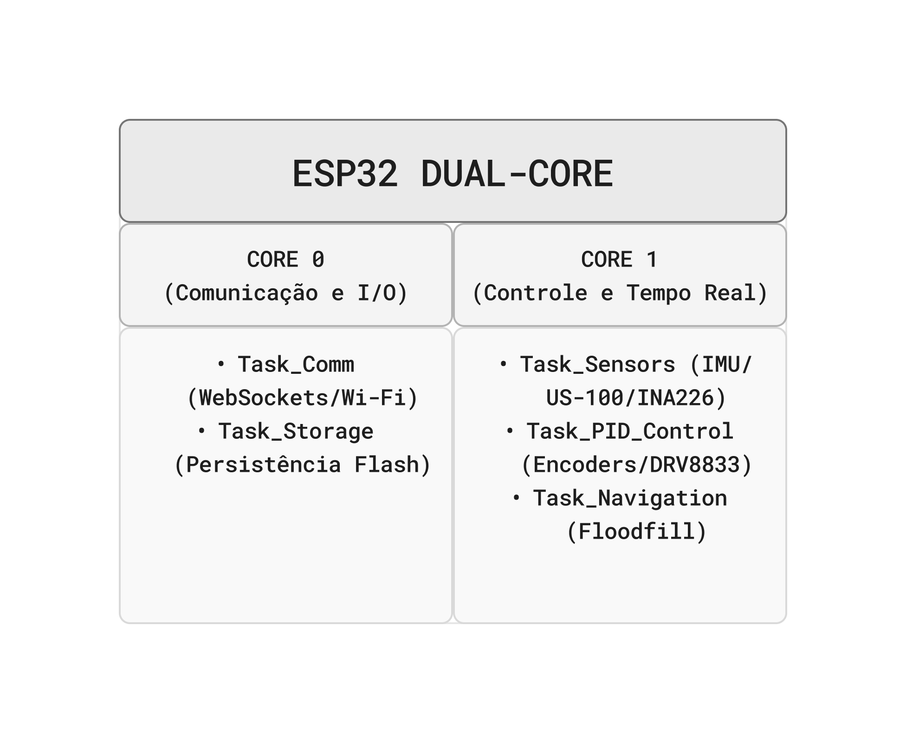
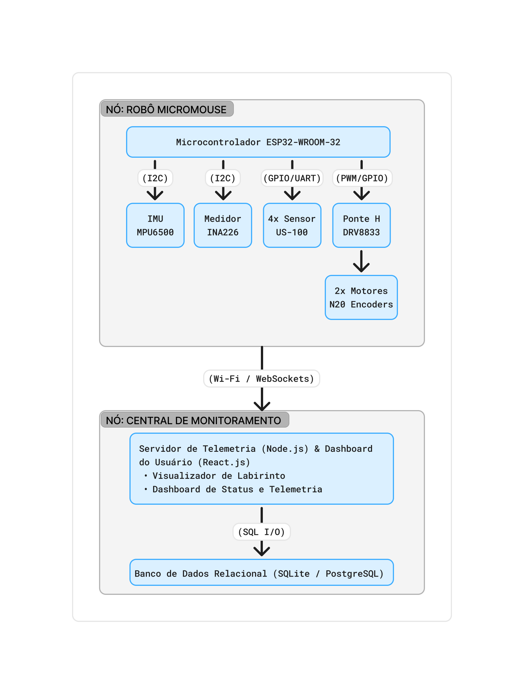
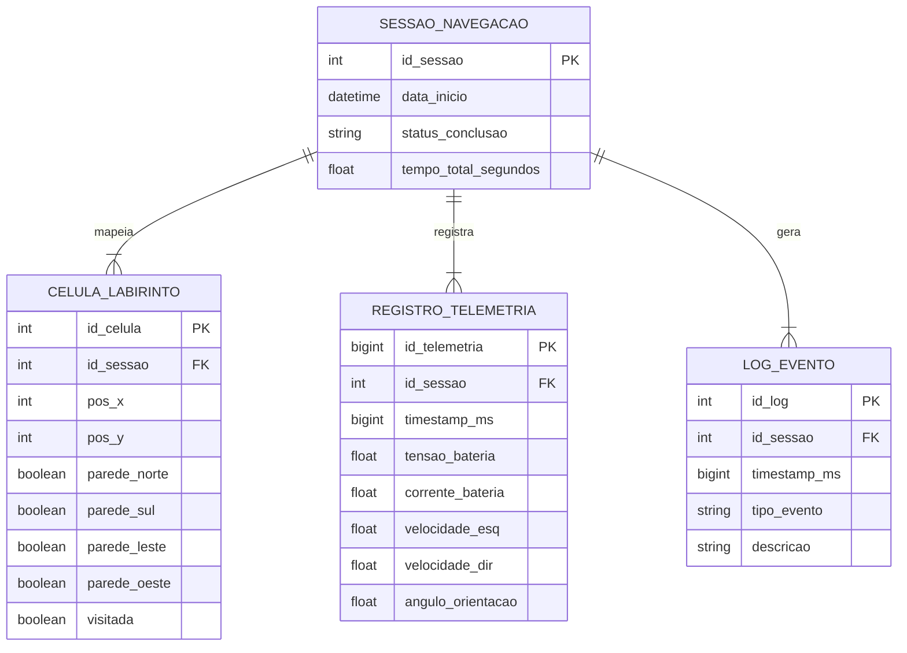

# Projeto Conceitual de Software

- [Explicações adicionais](https://drive.google.com/file/d/1WWIz6609c7Y7zAQRBWHSbX0t2vEJ2z1A/view?usp=sharing)
- [Noções de UML](https://drive.google.com/file/d/1l1yt2ittHuRKIXVXYT76P1HriR07pK-t/view?usp=sharing)
- [Requisitos](https://engsoftmoderna.info/cap3.html)

## Diagrama de Atividades

O diagrama abaixo descreve o fluxo de comportamento funcional do MicroMouse durante uma corrida,
desde o início da execução até a chegada ao objetivo, evidenciando os três atores envolvidos
(raias/_swimlanes_): o **Robô** (firmware embarcado), o **Servidor** (sistema web de telemetria +
banco de dados) e o **Usuário** (que acompanha a corrida pelo dashboard).

## Diagrama de Atividades no Figma

<iframe style="border: 1px solid rgba(0, 0, 0, 0.1);" width="800" height="450" src="https://embed.figma.com/board/TayFIuY1BoFhklOIzuSOSx/PI1---Diagrama-de-Atividades?node-id=2-8&embed-host=share" allowfullscreen></iframe>

**Leitura do fluxo:**

- **Entradas:** Leituras dos sensores de distância a cada célula percorrida e calibração inicial do sistema.
- **Atividades do Robô:** Inicialização do sistema, mapeamento e atualização da localização do robô, decisão do próximo movimento e execução da navegação.
- **Ponto de decisão:** "Atingiu a saída?" separa o ciclo de navegação e tomada de decisão da etapa de encerramento da corrida.
- **Sincronização e Paralelismo:** A cada movimento executado, o robô dispara em segundo plano a transmissão de dados de telemetria para a Plataforma Web, mantendo o laço de navegação ativo de forma paralela.
- **Atividades da Plataforma Web:** Recebimento dos pacotes de telemetria, salvamento dos dados no banco de dados e atualização da interface do dashboard em tempo real.
- **Atividades do Usuário:** Acompanhamento da corrida ao vivo no dashboard e análise do relatório final de desempenho ao término do percurso.
- **Saídas:** Dados da corrida armazenados localmente no MicroMouse, histórico completo persistido no banco de dados e relatório exibido no dashboard web.

## 1. Requisitos Funcionais

### RF01/Épico-01: Mapear Labirinto

| ID (Link Github Projects) | Título | Prioridade |
|:------|:--|:--|
| HU-00 | Construção contínua do mapa interno do labirinto                          | Must |
| HU-01 | Detectar a presença e a proximidade de paredes adjacentes ao robô.        | Must |

#### HU-00 — Construção contínua do mapa interno do labirinto

**Eu, como** Operador da Equipe,
**gostaria que** o MicroMouse construa e atualize continuamente um mapa interno do labirinto à medida que se desloca,
**para que** ele identifique caminhos livres, paredes e becos sem saída de forma autônoma, permitindo a navegação sem intervenção humana.

**Critérios de aceitação:**
- Para cada célula visitada, o robô registra quais das 4 paredes foram identificadas (com base no RF04).
- O mapa interno é atualizado célula a célula, em tempo real, sem necessidade de reiniciar a exploração.
- Ao final do trajeto (com sucesso ou não), o mapa interno reflete corretamente a estrutura de paredes percebida pelos sensores até aquele ponto.
- O mapa interno pode ser recuperado/consultado pelo sistema para ser transmitido e exibido no sistema web (RF02/RF06).

**Protótipo de interface:** Não se aplica.

#### HU-01 — Detecção e medição de proximidade de paredes

**Eu, como** Operador da Equipe,
**gostaria que** o sistema de sensores do MicroMouse detecte a presença e meça a distância das paredes adjacentes (frente, esquerda e direita),
**para que** o robô possa evitar colisões, manter-se perfeitamente alinhado no centro do corredor e fornecer os dados estruturais necessários para o algoritmo de mapeamento.

**Critérios de aceitação:**

* O sistema deve realizar a leitura contínua dos sensores direcionais para identificar, de forma binária, a existência ou não de paredes à frente, à esquerda e à direita da célula atual.
* O hardware deve retornar valores numéricos de distância confiáveis para as paredes laterais detectadas, permitindo que a rotina de controle faça correções finas de alinhamento nos motores.
* A taxa de atualização  dos sensores deve ser alta o suficiente para processar a proximidade em tempo real, garantindo que o robô freie ou desvie antes de qualquer colisão, mesmo em velocidade máxima.
* Caso a leitura do sensor retorne um valor maior que a largura padrão do corredor do labirinto (ausência de parede), o sistema deve registrar e validar a direção como um "caminho livre" para o mapeamento.

**Protótipo de interface:** Não se aplica.

---

### RF02/Épico-02: Monitorar Localização

| ID (Link Github Projects) | Título | Prioridade |
|:------|:--|:--|
| HU-02 | Rastreamento da posição do robô na grade | Must |

#### HU-02 — Rastreamento da posição do robô na grade

**Eu, como** Operador da Equipe,
**gostaria que** o MicroMouse acompanhe e atualize sua posição exata (linha/coluna) dentro da grade do labirinto a cada movimento realizado,
**para que** o algoritmo de navegação (RF10) e os dados exibidos em tempo real (RF03) estejam sempre corretos.

**Critérios de aceitação:**
- Após cada movimento (avanço ou giro), a posição interna do robô é recalculada corretamente.
- A posição atual pode ser consultada e transmitida para exibição em tempo real (RF06/RF03).
- O robô nunca perde a referência da célula em que está durante uma tentativa válida (sem colisão/malfuncionamento).

**Protótipo de interface:** Não se aplica.

---

### RF03/Épico-03: Navegar labirinto

| ID (Link Github Projects) | Título | Prioridade |
|:------|:--|:--|
| HU-03 | Resolução autônoma do labirinto até o objetivo | Must |
| HU-04 | Executar a rotação de até 180° no próprio eixo. | Must |
| HU-05 | Executar o deslocamento linear para a frente e para trás | Must |
| HU-06 | Identificar ponto de saida e chegada do labirinto | Must |

#### HU-03 — Resolução autônoma do labirinto até o objetivo

**Eu, como** Operador da Equipe,
**gostaria que** o MicroMouse execute autonomamente algoritmos de busca e tomada de decisão para percorrer o labirinto, desde o ponto de partida até a área de objetivo, sem intervenção humana,
**para que** a equipe cumpra o desafio da competição dentro das regras do contrato.

**Critérios de aceitação:**
- O robô inicia sempre no beco sem saída do canto de partida e para ao alcançar a célula de objetivo (canto diametralmente oposto).
- Nenhuma intervenção humana ocorre durante a resolução, exceto em caso de malfuncionamento ou colisão (conforme permitido pelo contrato).
- O robô detecta corretamente quando alcançou a área de objetivo e encerra a tentativa.
- O algoritmo é capaz de resolver os três tipos de labirinto da competição (4x4, 8x4 e 12x4) dentro do limite de até 3 tentativas e 10 minutos por desafio.
- O código e a memória sobre o labirinto não são alterados manualmente durante a resolução do trajeto (regra do contrato).

**Protótipo de interface:** Não se aplica.

#### HU-04 — Rotação no próprio eixo para mudança de direção

**Eu, como** Operador da Equipe,
**gostaria que** o sistema de tração do MicroMouse execute rotações precisas de até 180° em torno do seu próprio eixo geométrico,
**para que** ele possa mudar de direção em cruzamentos (90° à esquerda ou à direita) e retornar em becos sem saída (180°) de forma ágil, sem encostar nas paredes laterais.

**Critérios de aceitação:**

* O robô deve utilizar tração diferencial (girar uma roda para frente e a outra para trás na mesma proporção) para garantir que o raio de giro seja zero, rotacionando exatamente sobre o seu centro.
* O sistema de controle deve garantir o ângulo exato da rotação, compensando a inércia para que o robô termine o movimento perfeitamente alinhado ao novo corredor.
* Após concluir a rotação , a estrutura física do robô deve permanecer contida dentro dos limites da célula atual do labirinto.
* O movimento deve evitar acelerações bruscas que causem derrapagem (perda de tração), garantindo que a odometria do robô não perca a referência de sua posição no mapa.

**Protótipo de interface:** Não se aplica.

#### HU-05 — Deslocamento linear entre as células do labirinto

**Eu, como** Operador da Equipe,
**gostaria que** o MicroMouse realize deslocamentos lineares (para a frente e para trás) com controle de aceleração e velocidade,
**para que** ele transite de forma segura entre as células do labirinto, mantendo uma trajetória perfeitamente reta até o centro da próxima célula.

**Critérios de aceitação:**

* O robô deve avançar a distância exata correspondente a uma célula padrão do labirinto utilizando os encoders acoplados aos motores como referência de distância percorrida.
* A rotina de controle PID deve atuar continuamente durante o deslocamento linear, sincronizando as duas rodas para compensar desvios e manter o robô centralizado, utilizando dados dos sensores laterais.
* O hardware e o software devem suportar a reversão da polaridade/sinal dos motores para executar deslocamentos em marcha à ré de forma controlada, caso um ajuste fino de posicionamento seja necessário.
* A velocidade de deslocamento deve respeitar uma rampa de aceleração e desaceleração, garantindo uma frenagem suave ao atingir o centro da célula de destino.

**Protótipo de interface:** Não se aplica.

#### HU-06 — Identificação dos pontos de saída e chegada do labirinto

**Eu, como** Operador da Equipe,
**gostaria que** o sistema de navegação e mapeamento do MicroMouse consiga identificar de forma autônoma a célula inicial (ponto de partida) e a zona de destino (centro do labirinto),
**para que** o robô saiba exatamente quando iniciar o modo de exploração e pare ao reconhecer a linha de chegada.

**Critérios de aceitação:**

* Ao ser inicializado fisicamente na arena, o robô deve registrar automaticamente a célula atual como a coordenada de origem em seu mapa interno, definindo-a como a base para o início do mapeamento e ponto de retorno seguro.
* O algoritmo deve identificar o ponto de chegada reconhecendo a configuração física das celulas.
* Ao detectar que cruzou a zona de chegada, o robô deve interromper a lógica de exploração contínua, parar os motores de forma segura no centro da célula.
* Imediatamente após confirmar a chegada, o sistema deve salvar as coordenadas finais no mapa.

**Protótipo de interface:** Não se aplica.

---

### RF04/Épico-04: Realizar telemetria

| ID (Link Github Projects) | Título | Prioridade |
|:------|:--|:--|
| HU-07 | Coleta contínua de métricas de operação | Should |

#### HU-07 — Coleta contínua de métricas de operação

**Eu, como** Operador da Equipe,
**gostaria que** o MicroMouse colete e transmita continuamente métricas de operação (velocidade, tempo decorrido, consumo de bateria e status do desafio) para a central de controle,
**para que** seja possível o acompanhamento contínuo do desempenho do robô durante a corrida.

**Critérios de aceitação:**
- As métricas coletadas incluem, no mínimo: velocidade instantânea/média, tempo decorrido, percentual de bateria consumida e status da tentativa (em andamento / concluída / falha).
- As métricas são transmitidas junto com os demais dados de RF06, em intervalo regular definido pela equipe.
- As métricas coletadas ficam disponíveis para exibição em tempo real nas telas de RF03 (HU-03) e, após a corrida, no histórico (HU-04).

**Protótipo de interface:** Não se aplica.

---

### RF05/Épico-05: Gerenciar dados

| ID (Link Github Projects) | Título | Prioridade |
|:------|:--|:--|
| HU-08 | Exibir os dados estruturais e o mapa do labirinto. | Should |
| HU-09 | Exibir as informações de status, parâmetros e estado do robô MicroMouse. | Should |
| HU-10 | Enviar os dados coletados pelos sensores e sistema de bordo para o dashbord | Should |
| HU-11 | Armazenar as informações operacionais coletadas durante a navegação | Should |
| HU-12 | Manter histórico de sessões, eventos, erros e diagnósticos do sistema. | Should |

#### HU-08 — Exibir os dados estruturais e o mapa do labirinto

**Eu, como** Operador da Equipe,
**gostaria que** o dashboard exiba uma representação gráfica bidimensional e atualizada do mapa do labirinto,
**para que** eu possa acompanhar visualmente o progresso da exploração, validando se o robô identificou corretamente as paredes, caminhos livres e a sua posição atual.

**Critérios de aceitação:**

* A interface deve renderizar uma grade compatível com as dimensões oficiais do labirinto .
* As paredes recém-descobertas pelo robô devem aparecer no mapa em tempo real à medida que os dados são recebidos.
* A célula onde o robô se encontra no momento deve ser destacada visualmente.
* O mapa deve diferenciar células inexploradas daquelas que já foram visitadas.

**Protótipo de interface:** 

#### HU-09 — Exibir as informações de status e telemetria do robô

**Eu, como** Analista da Equipe,
**gostaria que** o painel exiba indicadores críticos de hardware e software em tempo real (como tensão da bateria, velocidade, leituras brutas de sensor e modo de operação),
**para que** eu possa monitorar a saúde do sistema durante a corrida e tomar decisões precisas sobre calibração e manutenção.

**Critérios de aceitação:**

* O dashboard deve apresentar o nível de tensão da bateria, emitindo um alerta visual caso a voltagem caia abaixo de um limite seguro (evitando danos à bateria).
* Os valores atuais de erro do controle PID e as velocidades das rodas (odometria) devem ser exibidos de forma contínua.
* O estado lógico atual do robô (ex: "Mapeando", "Retornando", "Parado por Erro") deve estar visível e em destaque.

**Protótipo de interface:** 

#### HU-10 — Transmissão de dados de bordo para o dashboard

**Eu, como** Analista da equipe,
**gostaria de** que fossem transmitidos pacotes compactados de telemetria e atualizações de mapa via conexão sem fio,
**para que** a interface de controle seja alimentada com dados contínuos sem que isso cause travamentos ou atrasos no processamento crítico de navegação (PID e leitura de sensores).

**Critérios de aceitação:**

* A rotina de envio de dados deve ser executada de forma assíncrona ou em uma thread separada, garantindo que não afete a taxa de atualização dos motores.
* Os pacotes de dados devem ser enviados em um formato estruturado e leve como JSON ou buffers binários.
* O sistema deve lidar com perdas momentâneas de sinal, reconectando-se automaticamente e descartando/reenviando pacotes defasados sem travar o microcontrolador.

**Protótipo de interface:** Não se aplica.

#### HU-11 — Armazenamento das informações de navegação

**Eu, como** Analista da Equipe,
**gostaria que** o sistema salve localmente ou no banco de dados do dashboard as coordenadas de percurso, tempos e rotas geradas,
**para que** seja possível realizar uma análise detalhada pós-corrida e aprimorar os algoritmos de aceleração e trajetória.

**Critérios de aceitação:**

* Ao final de cada execução, o tempo total da rota (da largada à chegada) deve ser gravado e associado àquela sessão específica.

**Protótipo de interface:** Não se aplica.

#### HU-12 — Histórico de sessões, eventos e diagnósticos

**Eu, como** Desenvolvedor de Software,
**gostaria que** o sistema mantenha um log cronológico de eventos e erros registrados durante as sessões de funcionamento,
**para que** eu consiga realizar um diagnóstico (debug) eficiente de falhas sistêmicas que tenham ocorrido enquanto o robô operava de forma autônoma na pista.

**Critérios de aceitação:**

* O sistema deve registrar eventos importantes com seus respectivos "timestamps" .
* As mensagens devem ser categorizadas por nível de severidade (ex: `INFO` para mudanças de estado, `WARNING` para derrapagens identificadas, `ERROR` para falhas de comunicação ou colisão física).
* A interface web/dashboard deve possuir uma aba dedicada para a consulta e filtragem do histórico das sessões passadas.

**Protótipo de interface:**

---

### RF06/Épico-06: Interromper motores

| ID (Link Github Projects) | Título | Prioridade |
|:------|:--|:--|
| HU-13 | Interromper alimentação dos motores  | Should |
| HU-14 | Parada de segurança por falha de software / Watchdog  | Should |

#### HU-13 — Interromper alimentação dos motores

**Eu, como** Sistema de Segurança Embarcado,
**gostaria de** cortar imediatamente os sinais de controle (PWM) e a alimentação elétrica direcionada aos drivers dos motores,
**para que** o robô freie de forma segura ao concluir a meta do labirinto, ao receber um comando de parada ou ao detectar uma falha crítica (como travamento das rodas ou colisão iminente).

**Critérios de aceitação:**

* O sistema de controle deve ser capaz de enviar um comando de parada instantânea (Duty Cycle de 0% no PWM) para a ponte H / driver de motor assim que a condição de chegada ou falha for acionada.
* Em caso de falha de software, deve haver um mecanismo físico de segurança que garanta a desenergização da tração.
* A interrupção dos motores não deve desligar os sensores ou a placa lógica, permitindo que o robô continue transmitindo dados de telemetria e o log do erro ocorrido.

**Protótipo de interface:** Não se aplica.

#### HU-14 — Parada de segurança por falha de software / Watchdog 

**Eu, como** Microcontrolador do MicroMouse,
**gostaria de** utilizar um temporizador de segurança independente (*Watchdog Timer*),
**para que** os sinais de controle dos motores sejam zerados automaticamente na eventualidade do software travar ou entrar em um loop infinito, impedindo que o robô acelere de forma cega e descontrolada.

**Critérios de aceitação:**

* O *Watchdog Timer* (WDT) deve ser inicializado pelo hardware com um tempo limite curto e agressivo (ex: 100ms a 200ms).
* A rotina principal de navegação deve "alimentar" (resetar) o WDT a cada ciclo de controle concluído com sucesso.
* Em caso de travamento do código (estouro do tempo do WDT), a interrupção gerada no hardware deve, antes de reiniciar o microcontrolador, forçar os pinos de saída PWM das pontes H para nível lógico baixo (0V).

**Protótipo de interface:** Não se aplica.

### RF07/Épico-07: Controlar rotinas

| ID (Link Github Projects) | Título | Prioridade |
|:------|:--|:--|
| HU-15 | Controlar rotinas de inicialização e calibração  | Should |
| HU-16 | Encerramento seguro e salvamento de estado | Should |

#### HU-15 — Controlar rotinas de inicialização e calibração

**Eu, como** Operador da Equipe,
**gostaria de** utilizar botões físicos no chassi e digitais no dashbord do robô para iniciar ou desligar as rotinas principais e acionar o processo de calibração dos sensores antes da largada,
**para que** o controle de navegação (PID) obtenha as leituras de referência exatas (como luz ambiente e distâncias base) e o robô inicie o mapeamento de forma estável, sem movimentos acidentais ao ser ligado.

**Critérios de aceitação:**

* A placa de circuito impresso  deve possuir botões físicos acessíveis que sejam lidos pelo microcontrolador.
* Ao pressionar o botão de calibração, o robô deve permanecer com os motores travados (desligados) enquanto realiza múltiplas leituras dos sensores para calcular a média e eliminar ruídos de leitura .
* O robô deve fornecer um feedback visual (ex: acender uma sequência de LEDs) ou sonoro (buzzer) para informar ao operador que a calibração foi concluída com sucesso e que a rotina de controle está pronta para iniciar a movimentação.
* O desligamento da rotina de controle por meio de botão físico ou digital deve parar imediatamente o processamento de navegação.

**Protótipo de interface:** Não se aplica.

#### HU-16 — Encerramento seguro e salvamento de estado

**Eu, como** Sistema de Mapeamento,
**gostaria de** executar uma rotina de encerramento controlado (*Graceful Shutdown*) ao receber o comando de parada,
**para que** o mapa topológico gerado durante a exploração seja salvo de forma íntegra na memória não-volátil antes do sistema ser totalmente desativado.

**Critérios de aceitação:**

* Ao acionar o botão de parada ou ao detectar a chegada, a prioridade máxima é desenergizar os motores, mas o microcontrolador deve permanecer ativo para processar o encerramento.
* A rotina deve validar a matriz do mapa e gravá-la na memória persistente, garantindo que os dados do labirinto sobrevivam ao desligamento total da bateria.
* Após o salvamento bem-sucedido, o sistema deve emitir um feedback claro (ex: LED verde contínuo ou bipe longo) indicando que o desligamento físico geral agora é seguro e que não haverá corrupção de dados.

**Protótipo de interface:** Não se aplica.

## 2. Rastreabilidade

| HU    | RF | RNFs |
|:------|:---|:-----|
| HU-00 | RF-01 | RNF-04, RNF-07 |
| HU-01 | RF-01 | RNF-04, RNF-05, RNF-09, RNF-20 |
| HU-02 | RF-02 | RNF-04, RNF-18 |
| HU-03 | RF-03 | RNF-02, RNF-07 |
| HU-04 | RF-03 | RNF-04, RNF-12, RNF-15, RNF-18 |
| HU-05 | RF-03 | RNF-04, RNF-05, RNF-15, RNF-18, RNF-19 |
| HU-06 | RF-03 | RNF-07 |
| HU-07 | RF-04 | RNF-11 |
| HU-08 | RF-05 | RNF-11 |
| HU-09 | RF-05 | RNF-11 |
| HU-10 | RF-05 | RNF-11 |
| HU-11 | RF-05 | RNF-01 |
| HU-12 | RF-05 | RNF-01 |
| HU-13 | RF-06 | RNF-05, RNF-06, RNF-13 |
| HU-14 | RF-06 | RNF-05, RNF-06, RNF-13 |
| HU-15 | RF-07 | RNF-09 |
| HU-16 | RF-07 | RNF-01 |

# Arquitetura de Software: Solução MicroMouse

Este documento apresenta a especificação arquitetural do sistema embarcado e da central de monitoramento para o robô **MicroMouse**, estruturado de acordo com o modelo de **Visões Arquiteturais (4+1)** do Processo Unificado (UP). Em conformidade com as diretrizes do projeto, a tradicional _Visão de Casos de Uso_ foi substituída pela **Visão de Dados**.

---

## 1. Visão Geral e Propósito do Software

### 1.1 Propósito do Software

O software possui o papel de atuar como o **sistema de controle autônomo e telemetria de bordo** do robô MicroMouse. Ele é responsável por:

- Processar sinais de sensores em tempo real para identificação de paredes, localização e orientação.

- Executar algoritmos de navegação e mapeamento dinâmico do labirinto.

- Controlar os atuadores (motores via controle PID e odometria) para movimentação precisa.

- Persistir e transmitir dados de telemetria, logs de execução e a topologia do labirinto para uma central de controle via Wi-Fi em tempo real.

---

## 2. Visão Lógica

A Visão Lógica descreve a organização conceitual e a estruturação das classes e módulos do sistema.

### 2.1 Padrões Arquiteturais Adotados e Justificativa

- Firmware Embarcado (Robô): Arquitetura em Camadas (Layered Architecture) orientada a Eventos/Tarefas.
  - **Justificativa:** O software de bordo lida diretamente com o hardware do microcontrolador ESP32. A divisão em camadas garante o desacoplamento entre os drivers de baixo nível (I2C, PWM, GPIO), a lógica de controle PID/Navegação e a camada de comunicação de alto nível.

- Dashboard (Central de Controle): Padrão MVC (Model-View-Controller).
  - **Justificativa:** Permite a separação entre a interface visual que renderiza o labirinto e métricas do robô (**View**), os serviços que processam as mensagens WebSockets recebidas (**Controller**) e os modelos de dados da sessão e estado (**Model**).

### 2.2 Divisão em Módulos do Sistema

1. Módulo HAL / Drivers de Hardware (Baixo Nível):
   * _Driver IMU (MPU6500):_ Leitura do giroscópio e acelerômetro via I2C para estimativa de orientação.

   * _Driver Ultrassônico (US-100):_ Leitura contínua da distância de paredes via UART/GPIO.

   * _Driver Ponte H (DRV8833):_ Controle PWM para acionamento dos motores N20.

   * _Driver de Odometria (Encoders N20):_ Contagem de pulsos por interrupção para cálculo de deslocamento.

   * _Driver de Potência (INA226):_ Monitoramento de tensão e corrente da bateria via I2C.

2. Módulo de Controle e Navegação (Médio Nível):
   * _Malha de Controle PID:_ Mantém o robô centralizado e estabilizado durante a locomoção.

   * _Mapeador e Buscador (Floodfill):_ Atualiza a matriz do labirinto e calcula as ações de rotação e avanço.

3. Módulo de Comunicação e Armazenamento (Alto Nível):
   * _Gerenciador NVS/Flash:_ Armazena configurações e histórico de logs localmente.

   * _Servidor WebSockets/Wi-Fi:_ Transmite a telemetria do robô e atualizações do mapa.

---

## 3. Visão de Processos

A Visão de Processos trata da concorrência, tempo real e distribuição do processamento entre as tarefas do sistema.

O microcontrolador **ESP32** conta com dois núcleos de processamento (Core 0 e Core 1) e executa o sistema operacional de tempo real **FreeRTOS**. As tarefas (_Tasks_) são distribuídas entre os núcleos para garantir resposta imediata aos sensores sem bloquear as rotinas de comunicação:

* **Processo 1: `Task_Sensors` (Periódico - 10ms | Prioridade Alta):**
  * Executa a amostragem do giroscópio MPU6500 e a leitura dos 4 sensores US-100 para identificação imediata de obstáculos/paredes.

* **Processo 2: `Task_PID_Control` (Periódico - 5ms | Prioridade Máxima):**
  * Processa interrupções dos leitores de encoder dos motores N20, calcula os erros de trajetória e atualiza o ciclo de trabalho PWM da ponte H DRV8833.

* **Processo 3: `Task_Navigation` (Baseado em Eventos | Prioridade Média):**
  * Disparada quando o robô alcança o centro de uma célula. Executa a lógica de atualização da grade de navegação e decide a próxima direção.

* **Processo 4: `Task_Comm` (Assíncrono | Prioridade Baixa):**
  * Formata os dados no formato JSON e envia pacotes de telemetria e o estado do labirinto para a central de controle via WebSockets.

---

## 4. Visão de Implementação

A Visão de Implementação especifica as tecnologias, linguagens, frameworks e bibliotecas escolhidas para a solução.

### 4.1 Tecnologias Adotadas

| Camada                            | Tecnologia / Linguagem      | Frameworks e Bibliotecas                                                             | Justificativa                                                                                                                            |
| --------------------------------- | --------------------------- | ------------------------------------------------------------------------------------ | ---------------------------------------------------------------------------------------------------------------------------------------- |
| **Firmware (Embarcado)**          | **C++ / C**              | FreeRTOS, Arduino ESP32 Core, `Wire.h` (I2C), `ESPAsyncWebServer`, `ArduinoJson`  | Permite controle rigoroso de baixo nível, acesso direto aos registradores e periféricos da ESP32 com altíssimo desempenho de tempo real. |
| **Dashbord (Backend/Server)**     | **TypeScript / Node.js**    | Express.js, `ws` (WebSockets), TypeORM / Prisma                                      | Plataforma leve e eficiente em I/O assíncrono para manipulação da transmissão contínua de dados de telemetria.                           |
| **Dashbord (Frontend/Dashboard)** | **TypeScript / JavaScript** | React.js, TailwindCSS, Chart.js, HTML5 Canvas API                                    | Permite renderização fluida da grade do labirinto em tempo real e atualização gráfica das métricas do robô.                              |

---

## 5. Visão de Implantação

A Visão de Implantação descreve a arquitetura física e a topologia de hardware da solução.

### Componentes de Hardware Utilizados e Conexões:

1. **ESP32 DevKit V1 30 Pinos:** Unidade Central de Processamento.

2. **Ponte H DRV8833:** Conectada às saídas PWM da ESP32 para controle bidirecional dos Motores N20-6V.

3. **2x Motores N20 com Encoders:** Conectados a pino de interrupção da ESP32 para feedback de malha fechada.

4. **3x Sensores Ultrassônicos US-100:** Dispostos nas posições frontal, esquerda e direita para mapeamento de paredes.

5. **IMU MPU6500:** Conectado via barramento I2C para estimativa de ângulo e giros precisos de 180°.

6. **Sensor INA226:** Conectado via I2C para leitura de corrente e tensão da bateria.

7. **Regulador Buck MP1584:** Regula a tensão de alimentação dos módulos lógicos.

---

## 6. Visão de Dados

A Visão de Dados descreve a modelagem e a estrutura de persistência das informações manipuladas e gravadas pelo sistema.

### 6.1 Escolha da Tecnologia de Banco de Dados: **Relacional (SQLite / PostgreSQL)**

- **Justificativa:** Os dados manipulados pelo sistema possuem um alto grau de estruturação e esquemas rígidos (ex: coordenadas $X,Y$ fixas em uma matriz, leituras periódicas de telemetria vinculadas a uma sessão de execução e registros tabulares de erros).

- No **Dashbord**, adota-se um **Banco de Dados Relacional** (SQLite para execução local simples ou PostgreSQL para diagnósticos avançados).

- No **Robô (ESP32)**, utiliza-se a memória Flash interna (via biblioteca `Preferences` ou sistema de arquivos `LittleFS`) configurada estruturalmente em formato relacional/tabelar binário para armazenamento offline caso ocorra perda do link Wi-Fi.

---

### 6.2 Modelo Entidade-Relacionamento (MER)

#### Entidades e Atributos:

1. **SESSAO_NAVEGACAO:**

- `id_sessao` (PK, Inteiro): Identificador único do percurso.

- `data_inicio` (DateTime): Registro do momento do início da corrida.

- `status_conclusao` (Texto): Status do percurso (Em andamento, Concluído, Interrompido por Falha).

- `tempo_total_segundos` (Float): Tempo transcorrido até o reconhecimento da linha de chegada.

2. **CELULA_LABIRINTO:**

- `id_celula` (PK, Inteiro): Identificador da célula.

- `id_sessao` (FK, Inteiro): Referência à sessão atual.

- `pos_x` (Inteiro): Coordenada $X$ da célula na grade do labirinto.

- `pos_y` (Inteiro): Coordenada $Y$ da célula na grade do labirinto.

- `parede_norte` (Booleano): Presença de parede ao Norte.

- `parede_sul` (Booleano): Presença de parede ao Sul.

- `parede_leste` (Booleano): Presença de parede ao Leste.

- `parede_oeste` (Booleano): Presença de parede ao Oeste.

- `visitada` (Booleano): Flag indicando se o robô passou pela célula.

3. **REGISTRO_TELEMETRIA:**

- `id_telemetria` (PK, BigInt): Identificador único da amostra.

- `id_sessao` (FK, Inteiro): Sessão associada.

- `timestamp_ms` (BigInt): Milissegundos transcorridos desde o boot.

- `tensao_bateria` (Float): Leitura do sensor INA226 em Volts.

- `corrente_bateria` (Float): Leitura do sensor INA226 em Amperes.

- `velocidade_esq` (Float): Velocidade calculada do motor esquerdo em mm/s.

- `velocidade_dir` (Float): Velocidade calculada do motor direito em mm/s.

- `angulo_orientacao` (Float): Leitura de orientação Yaw da IMU MPU6500.

4. **LOG_EVENTO:**

- `id_log` (PK, Inteiro): Identificador do registro.

- `id_sessao` (FK, Inteiro): Sessão associada.

- `timestamp_ms` (BigInt): Horário do evento.

- `tipo_evento` (Texto): Categoria (INFO, WARN, ERROR, SUCCESS).

- `descricao` (Texto): Detalhamento do evento (ex: "Linha de Chegada Reconhecida", "Motores Interrompidos").

#### Relacionamentos e Cardinalidades:

- Uma **SESSAO_NAVEGACAO** possui $1:N$ **CELULA_LABIRINTO** (Uma sessão gera o mapeamento de várias células do labirinto).

- Uma **SESSAO_NAVEGACAO** possui $1:N$ **REGISTRO_TELEMETRIA** (Uma sessão coleta continuadamente múltiplos pacotes de telemetria).

- Uma **SESSAO_NAVEGACAO** possui $1:N$ **LOG_EVENTO** (Uma sessão registra diversos logs operacionais).

---

### 6.3 Diagrama Entidade-Relacionamento (DER)

```mermaid
erDiagram
    SESSAO_NAVEGACAO ||--|{ CELULA_LABIRINTO : "mapeia"
    SESSAO_NAVEGACAO ||--|{ REGISTRO_TELEMETRIA : "registra"
    SESSAO_NAVEGACAO ||--|{ LOG_EVENTO : "gera"

    SESSAO_NAVEGACAO {
        int id_sessao PK
        datetime data_inicio
        string status_conclusao
        float tempo_total_segundos
    }

    CELULA_LABIRINTO {
        int id_celula PK
        int id_sessao FK
        int pos_x
        int pos_y
        boolean parede_norte
        boolean parede_sul
        boolean parede_leste
        boolean parede_oeste
        boolean visitada
    }

    REGISTRO_TELEMETRIA {
        bigint id_telemetria PK
        int id_sessao FK
        bigint timestamp_ms
        float tensao_bateria
        float corrente_bateria
        float velocidade_esq
        float velocidade_dir
        float angulo_orientacao
    }

    LOG_EVENTO {
        int id_log PK
        int id_sessao FK
        bigint timestamp_ms
        string tipo_evento
        string descricao
    }

```

---

Para garantir a cobertura das principais funcionalidades do seu MicroMouse descritas no "backlog-mvp.md", estruturei o roteiro abaixo focando nos fluxos críticos de hardware e software: percepção, navegação autônoma, telemetria, segurança e calibração.

### CT-01: Validação de Detecção de Paredes e Atualização do Mapa

* **Código do caso de teste:** CT-01
* **Nome do caso de teste:** Detecção e Mapeamento Contínuo
* **Rastreabilidade:** RF01 (HU-00, HU-01)

* **Objetivo do caso de teste:** Validar se o robô identifica corretamente as paredes adjacentes e se o mapa interno reflete essa estrutura célula a célula de forma contínua.

* **Pré-condições:** Robô posicionado na célula inicial de um labirinto físico de teste. Sensores de proximidade ativos e hardware energizado.

* **Procedimentos:**
  1. Iniciar o modo de exploração do robô em um trecho contendo caminhos livres, paredes laterais e um beco sem saída.
  2. Acompanhar a leitura contínua dos sensores direcionais nas posições frente, esquerda e direita.
  3. Interromper fisicamente o robô após 5 células exploradas e consultar a matriz do mapa interno gerado.
* **Resultado esperado:**
  * Os sensores retornam valores numéricos confiáveis para as laterais e leituras binárias indicando ausência ou presença de paredes.
  * Direções com distância maior que a largura do corredor são validadas como "caminhos livres".
  * O mapa interno reflete a estrutura exata do trajeto percorrido sem necessidade de reiniciar a exploração.

### CT-02: Navegação Autônoma, Rotação e Identificação do Objetivo

* **Código do caso de teste:** CT-02
* **Nome do caso de teste:** Resolução Autônoma do Labirinto
* **Rastreabilidade:** RF03 (HU-03, HU-04, HU-05, HU-06)
* **Objetivo do caso de teste:** Garantir que a lógica de controle PID, a tração diferencial e a identificação do objetivo atuem em conjunto para resolver o labirinto.
* **Pré-condições:** Robô localizado no beco sem saída do canto de partida (origem) de um labirinto padrão (4x4, 8x4 ou 12x4).
* **Procedimentos:**
  1. Dar a partida no robô sem realizar intervenções manuais subsequentes.
  2. Observar um deslocamento linear completo entre duas células e uma manobra de rotação de 180° em um beco sem saída.
  3. Aguardar o robô alcançar o centro geográfico do labirinto (área de objetivo).
* **Resultado esperado:**
  * A rotação ocorre exatamente sobre o centro geométrico do robô (raio zero), mantendo-o contido nos limites da célula.
  * O avanço linear respeita rampas de aceleração e é corrigido lateralmente pelo PID.
  * Ao cruzar a zona de chegada, o robô interrompe a exploração, para os motores no centro da célula de destino e salva as coordenadas finais.

### CT-03: Transmissão de Telemetria e Renderização no Dashboard

* **Código do caso de teste:** CT-03
* **Nome do caso de teste:** Telemetria e Interface de Controle
* **Rastreabilidade:** RF04 (HU-07), RF05 (HU-08, HU-09, HU-10)
* **Objetivo do caso de teste:** Verificar se o sistema envia dados operacionais assincronamente e se o dashboard exibe essas métricas e o mapa atualizado.
* **Pré-condições:** Conexão sem fio estabelecida entre o robô e o painel. Robô executando percurso na arena.
* **Procedimentos:**
  1. Iniciar o monitoramento via dashboard web simultaneamente à exploração do robô.
  2. Conferir os indicadores críticos de hardware durante a execução (tensão da bateria, velocidade e erros PID).
  3. Observar a grade bidimensional renderizada na interface à medida que novos dados chegam.

* **Resultado esperado:**
  * Pacotes (JSON ou binários) são transmitidos sem prejudicar a atualização dos motores.
  * O painel emite alertas visuais para quedas de voltagem e exibe o estado lógico atual (ex: "Mapeando").
  * O mapa diferencia visualmente as células inexploradas, as já visitadas e destaca a posição atual do robô em tempo real.

### CT-04: Atuação do Watchdog e Parada de Segurança

* **Código do caso de teste:** CT-04
* **Nome do caso de teste:** Desenergização por Falha de Software (Watchdog)
* **Rastreabilidade:** RF06 (HU-13, HU-14)
* **Objetivo do caso de teste:** Confirmar o corte da alimentação de tração para prevenir acelerações descontroladas em caso de travamento do sistema.
* **Pré-condições:** Robô operando na pista. *Watchdog Timer* (WDT) configurado com limite de 100ms a 200ms.
* **Procedimentos:**
  1. Iniciar um deslocamento linear padrão na pista.
  2. Simular um loop infinito ou travamento intencional no código principal de navegação para impedir a alimentação (reset) do WDT.
  3. Avaliar o comportamento das rodas e das transmissões de rede após a injeção da falha.

* **Resultado esperado:**
  * O WDT estoura e força os pinos PWM das pontes H para nível lógico baixo (0V), enviando um comando de parada instantânea (Duty Cycle 0%).
  * Os motores são totalmente desenergizados de forma segura.
  * A placa lógica e os sensores não são desligados, permitindo que o robô transmita o log do erro de travamento ocorrido.

### CT-05: Calibração Inicial e Encerramento Seguro (Graceful Shutdown)

* **Código do caso de teste:** CT-05
* **Nome do caso de teste:** Setup de Partida e Salvamento de Estado
* **Rastreabilidade:** RF07 (HU-15, HU-16)
* **Objetivo do caso de teste:** Validar se a estabilidade é garantida na inicialização via botões físicos e se o mapa não é corrompido ao desligar.
* **Pré-condições:** Sistema posicionado na arena com a bateria energizada, mas sistema lógico aguardando calibração. Memória persistente pronta para gravação.
* **Procedimentos:**
  1. Pressionar o botão físico de calibração localizado na placa de circuito impresso do chassi.
  2. Após o feedback de sucesso, iniciar um movimento curto e acionar o comando de parada / botão de encerramento controlado.
  3. Desligar fisicamente a bateria após o aviso do sistema e religá-la para conferir o mapa.

* **Resultado esperado:**
  * Durante a leitura para média dos sensores, os motores permanecem estritamente travados e desligados.
  * Um LED ou buzzer confirma o fim da calibração.
  * Ao acionar o encerramento, a matriz do mapa é salva integralmente na memória não-volátil, emitindo um feedback (LED verde ou bipe longo) indicando que o desligamento total agora é seguro.
